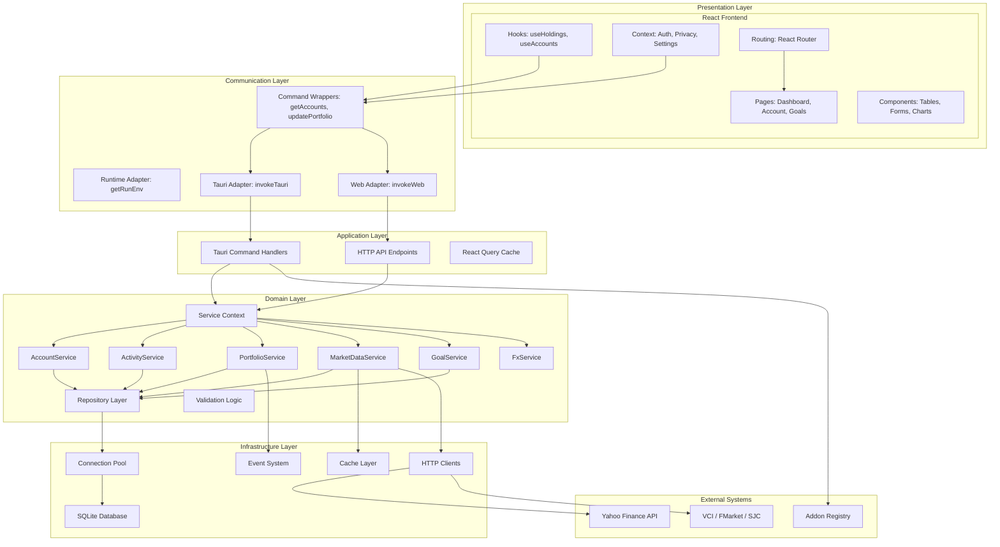
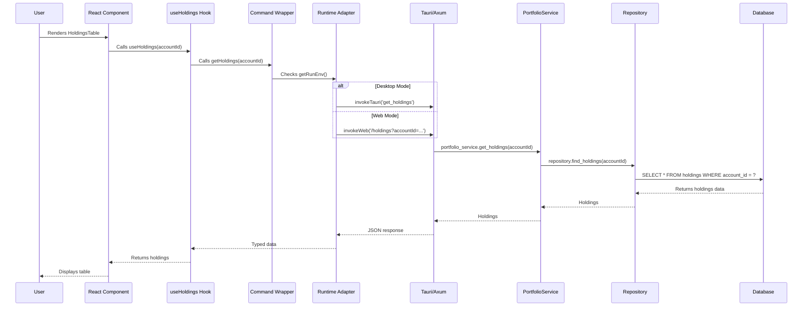

# Component Architecture

This document provides a detailed breakdown of Wealthfolio's components at the
module level, showing how they interact and depend on each other.

## Overview

Wealthfolio's component architecture follows a layered design with clear
separation of concerns:

1. **Presentation Layer**: React components, pages, and hooks
2. **Communication Layer**: Adapters for Tauri (IPC) and Web (HTTP)
3. **Application Layer**: Commands, hooks, and orchestration
4. **Domain Layer**: Business logic services and repositories
5. **Infrastructure Layer**: Database, caching, external APIs

## Component Diagram



## Presentation Layer Components

### Pages (`src/pages/`)

Location: `src/pages/`

**Components**:

| Page           | Responsibility                 | Key Features                                              |
| -------------- | ------------------------------ | --------------------------------------------------------- |
| `dashboard/`   | Main portfolio dashboard       | Portfolio overview, recent activities, performance charts |
| `account/`     | Account details and management | Holdings list, transactions, performance                  |
| `activity/`    | Activity management            | Activity form, CSV import, bulk operations                |
| `goals/`       | Goal tracking                  | Goal creation, allocation, progress tracking              |
| `market-data/` | Market data management         | Manual quotes, data sources, sync status                  |
| `settings/`    | Application settings           | Preferences, currency, integrations, addons               |

**Dependencies**: Hooks, Components, Commands

---

### UI Components (`src/components/`)

Location: `src/components/`

**Categories**:

| Category      | Components                                               | Purpose                             |
| ------------- | -------------------------------------------------------- | ----------------------------------- |
| **Forms**     | `ActivityForm`, `GoalForm`, `AccountForm`                | Data entry and validation           |
| **Tables**    | `HoldingsTable`, `ActivitiesTable`, `QuotesTable`        | Data display with sorting/filtering |
| **Charts**    | `PerformanceChart`, `AllocationChart`                    | Data visualization                  |
| **Shared UI** | `Button`, `Input`, `Select`, `Dialog` (via @wealthvn/ui) | Reusable UI primitives              |
| **Layout**    | `PageLayout`, `Sidebar`, `Header`                        | App structure                       |

**Dependencies**: Radix UI, Recharts, @wealthvn/ui

---

### Hooks (`src/hooks/`)

Location: `src/hooks/`

**Data Fetching Hooks** (React Query):

| Hook                  | Command                   | Purpose                     |
| --------------------- | ------------------------- | --------------------------- |
| `useAccounts`         | `getAccounts`             | Fetch account list          |
| `useHoldings`         | `getHoldings`             | Fetch portfolio holdings    |
| `useActivities`       | `searchActivities`        | Fetch activities            |
| `useGoals`            | `getGoals`                | Fetch goals list            |
| `useValuationHistory` | `getHistoricalValuations` | Fetch historical valuations |
| `useMarketData`       | `getLatestQuotes`         | Fetch market quotes         |

**Custom Hooks**:

| Hook              | Purpose                    |
| ----------------- | -------------------------- |
| `useRunEnv`       | Detect desktop vs web mode |
| `useDebounce`     | Debounce input values      |
| `useMediaQuery`   | Responsive design queries  |
| `useLocalStorage` | Local storage persistence  |

**Dependencies**: TanStack Query, Commands

---

### Context Providers (`src/context/`)

Location: `src/context/`

| Provider           | State Managed                  | Usage                        |
| ------------------ | ------------------------------ | ---------------------------- |
| `AuthProvider`     | User authentication (web mode) | JWT tokens, login/logout     |
| `PrivacyProvider`  | Privacy toggle                 | Hide/show balances           |
| `SettingsProvider` | App settings                   | Currency, theme, preferences |

---

### Routing (`src/routes.tsx`)

Location: `src/routes.tsx`

**Structure**:

- Nested routes for sub-pages
- Dynamic addon routes
- Protected routes (auth required)
- Layout routes (with Sidebar/Header)

---

## Communication Layer Components

### Runtime Adapters (`src/adapters/`)

Location: `src/adapters/`

**Adapter Interface**:

```typescript
// Runtime detection
enum RUN_ENV {
  DESKTOP,
  WEB,
  UNSUPPORTED,
}

// Desktop adapter (Tauri)
function invokeTauri`T>`(command: string, args?: any): Promise`T>`;

// Web adapter (Axum)
function invokeWeb`T>`(url: string, body?: any): Promise`T>`;
```

**Key Files**:

- `index.ts` - Runtime detection (`getRunEnv`)
- `tauri.ts` - Desktop mode implementation
- `web.ts` - Web mode implementation

---

### Command Wrappers (`src/commands/`)

Location: `src/commands/`

Each backend command has a corresponding TypeScript wrapper:

| Command File     | Commands                                                 |
| ---------------- | -------------------------------------------------------- |
| `account.ts`     | `getAccounts`, `createAccount`, `updateAccount`          |
| `activity.ts`    | `searchActivities`, `createActivity`, `importActivities` |
| `portfolio.ts`   | `getHoldings`, `updatePortfolio`, `calculatePerformance` |
| `goals.ts`       | `getGoals`, `createGoal`, `updateGoalAllocations`        |
| `market-data.ts` | `syncMarketData`, `getLatestQuotes`, `searchSymbol`      |
| `settings.ts`    | `getSettings`, `updateSettings`                          |
| `addons.ts`      | `installAddonZip`, `toggleAddon`, `uninstallAddon`       |

**Pattern**:

```typescript
export async function getAccounts(): Promise`Account`[]> {
  const env = getRunEnv();
  return env === RUN_ENV.DESKTOP
    ? invokeTauri("get_accounts")
    : invokeWeb("/accounts");
}
```

---

## Application Layer Components

### Tauri Command Handlers (`src-tauri/src/commands/`)

Location: `src-tauri/src/commands/`

**Command Categories**:

| Category    | Commands Count | Example Commands                                            |
| ----------- | -------------- | ----------------------------------------------------------- |
| Account     | 4              | `get_accounts`, `create_account`                            |
| Activity    | 6              | `search_activities`, `create_activity`, `import_activities` |
| Portfolio   | 8              | `get_holdings`, `update_portfolio`, `calculate_performance` |
| Goals       | 5              | `get_goals`, `create_goal`, `update_goal_allocations`       |
| Market Data | 6              | `sync_market_data`, `get_latest_quotes`                     |
| Settings    | 3              | `get_settings`, `update_settings`                           |
| Addons      | 5              | `install_addon_zip`, `toggle_addon`                         |

**Total**: 83+ commands

**Pattern**:

```rust
#[tauri::command]
pub async fn get_accounts(
    state: tauri::State``'_, Arc`ServiceContext>`>,
) -> Result`Vec``Account>`, String> {
    state.account_service.get_all_accounts()
        .map_err(|e| e.to_string())
}
```

---

### HTTP API Endpoints (`src-server/src/api/`)

Location: `src-server/src/api/`

**Endpoint Categories** (mirroring Tauri commands):

| Category    | Endpoints | Example                                                                 |
| ----------- | --------- | ----------------------------------------------------------------------- |
| Auth        | 2         | `POST /auth/login`, `GET /auth/status`                                  |
| Accounts    | 4         | `GET /accounts`, `POST /accounts`, `PUT /accounts/:id`                  |
| Activities  | 5         | `POST /activities/search`, `POST /activities`, `DELETE /activities/:id` |
| Portfolio   | 7         | `GET /holdings`, `POST /portfolio/update`, `POST /performance/history`  |
| Goals       | 4         | `GET /goals`, `POST /goals`, `PUT /goals`                               |
| Market Data | 4         | `GET /market-data/search`, `POST /market-data/sync`                     |
| Addons      | 4         | `GET /addons/installed`, `POST /addons/install-zip`                     |
| Events      | 1         | `GET /events/stream` (SSE)                                              |

**Total**: 50+ endpoints

**Pattern**:

```rust
async fn get_accounts(
    State(state): State`Arc``ServiceContext>`>,
) -> Result`Json``Vec``Account>`>, ApiError> {
    state.account_service.get_all_accounts().await.map(Json)
}
```

---

### React Query Cache

Location: Global `QueryClient` instance

**Features**:

- Automatic caching of API responses
- Stale-while-revalidate strategy
- Query invalidation on data updates
- Optimistic updates (for some operations)

**Configuration**:

```typescript
const queryClient = new QueryClient({
  defaultOptions: {
    queries: {
      staleTime: 1000 * 60 * 5, // 5 minutes
      refetchOnWindowFocus: true,
    },
  },
});
```

---

## Domain Layer Components

### Service Context (`src-tauri/src/context/mod.rs`)

Location: `src-tauri/src/context/mod.rs`

**Responsibilities**:

- Dependency injection container
- Initialize all repositories and services
- Manage database connection pool
- Coordinate service lifecycles

**Dependencies Injected**:

- Database connection pool (r2d2)
- Repository instances
- Service instances
- Cache instances (moka)
- HTTP clients (reqwest)

---

### Core Services (`src-core/src/`)

Location: `src-core/src/services/`

| Service                 | Methods                                                      | Key Responsibilities       |
| ----------------------- | ------------------------------------------------------------ | -------------------------- |
| **AccountService**      | `get_all_accounts`, `create_account`, `update_account`       | Manage investment accounts |
| **ActivityService**     | `search_activities`, `create_activity`, `delete_activity`    | Track trading activities   |
| **PortfolioService**    | `get_holdings`, `update_portfolio`, `calculate_performance`  | Portfolio calculations     |
| **MarketDataService**   | `sync_market_data`, `get_latest_quotes`, `get_quote_history` | Market data fetching       |
| **GoalService**         | `get_goals`, `create_goal`, `update_goal_allocations`        | Goal management            |
| **FxService**           | `get_exchange_rates`, `update_exchange_rate`                 | Currency conversion        |
| **VnAssetsSyncService** | `sync_all_assets`, `fetch_vn_stocks`                         | VN market synchronization  |

---

### Repository Layer (`src-core/src/`)

Location: `src-core/src/accounts/`, `activities/`, etc.

**Repositories**:

| Repository            | Tables                                          | Methods                                    |
| --------------------- | ----------------------------------------------- | ------------------------------------------ |
| `AccountRepository`   | `accounts`                                      | `find_all`, `create`, `update`, `delete`   |
| `ActivityRepository`  | `activities`                                    | `search`, `create`, `update`, `delete`     |
| `AssetRepository`     | `assets`                                        | `find_by_symbol`, `update_profile`         |
| `QuoteRepository`     | `quotes`, `vn_historical_records`               | `get_latest`, `get_history`, `save`        |
| `GoalRepository`      | `goals`, `goals_allocation`                     | `find_all`, `create`, `update_allocations` |
| `ValuationRepository` | `daily_account_valuation`, `holdings_snapshots` | `get_history`, `save_snapshot`             |
| `SettingsRepository`  | `settings`                                      | `get`, `set`                               |

**ORM**: Diesel 2.2 with SQLite backend

---

## Infrastructure Layer Components

### Database (`src-core/`)

Location: `src-core/`

**Technology**: SQLite 3 + Diesel 2.2

**Components**:

- Database schema (via migrations)
- Connection pool (r2d2)
- Query builder (Diesel)
- Migration system

**Connection Pool Configuration**:

```rust
Pool::builder(r2d2::Pool::new(SqliteConnectionManager::new(db_path))?)
    .max_size(15)
    .build()?
```

---

### Cache Layer

Location: `src-tauri/src/` (service context)

**Technology**: Moka (in-memory cache)

**Use Cases**:

- Market data quotes (TTL: 15 minutes)
- Exchange rates (TTL: 1 hour)
- Asset profiles (TTL: 1 day)

**Configuration**:

```rust
Cache::new(EventuallyEvictionBuilder::new(max_capacity, ttl))
```

---

### HTTP Clients

Location: `src-core/src/` (services)

**Technology**: reqwest 0.12

**Clients**:

- Yahoo Finance API client
- VCI (Vietcap) client
- FMarket client
- SJC gold price client
- Addon registry client

**Features**:

- Async/await support
- Retry logic
- Rate limiting
- TLS/HTTPS

---

### Event System

Location: `src-tauri/src/lib.rs` (Tauri events)

**Events Emitted**:

| Event                       | Payload                 | Purpose                             |
| --------------------------- | ----------------------- | ----------------------------------- |
| `portfolio:update-start`    | None                    | Notify UI portfolio update started  |
| `portfolio:update-complete` | None                    | Notify UI portfolio update finished |
| `portfolio:update-error`    | Error message           | Notify UI of error                  |
| `market:sync-start`         | None                    | Notify UI market sync started       |
| `market:sync-complete`      | Count of assets updated | Notify UI sync finished             |

**Desktop**: Tauri events (`emit()`, `listen()`) **Web**: Server-Sent Events
(`SSE`)

---

## External System Components

### Market Data APIs

| API           | Client                    | Coverage                   |
| ------------- | ------------------------- | -------------------------- |
| Yahoo Finance | `yahoo_finance_api` crate | Global stocks, ETFs, funds |
| VCI (Vietcap) | Custom Rust client        | Vietnamese stocks          |
| FMarket       | Custom Rust client        | Vietnamese mutual funds    |
| SJC           | Custom Rust client        | Vietnamese gold prices     |

---

### Addon System Components

**Addon SDK** (`packages/addon-sdk/`):

- TypeScript types and interfaces
- Host API surface
- Permission definitions
- Utility functions

**Addon Runtime** (`src/addons/`):

- Addon discovery and loading
- Permission checking
- Dynamic route registration
- QueryClient injection

**Addon Dev Tools** (`packages/addon-dev-tools/`):

- CLI for scaffold new addons
- Dev server with hot reload
- File watching

---

## Component Dependencies

### Frontend Dependency Graph

```
Pages
  ↓
Components
  ↓
Hooks (use*)
  ↓
Commands (invokeTauri/invokeWeb)
  ↓
Adapters (Desktop/Web)
  ↓
Backend (Tauri/Axum)
```

### Backend Dependency Graph

```
Command Handlers / API Endpoints
  ↓
Services
  ↓
Repositories
  ↓
Database
```

### Cross-Cutting Concerns

- **Logging**: Tracing crate (Rust), console.log (TS)
- **Error Handling**: thiserror (Rust), try/catch (TS)
- **Validation**: Zod (TS), custom logic (Rust)
- **Serialization**: serde (Rust), JSON (TS)
- **Caching**: Moka (Rust), React Query (TS)

---

## Data Flow Example: Fetching Holdings



---

## Component Communication Patterns

### 1. Synchronous Request-Response (Desktop)

Frontend → Tauri IPC → Rust Service → Database

- Zero network latency
- Direct function call
- Blocking on main thread (use async for heavy ops)

### 2. Asynchronous HTTP (Web)

Frontend → HTTP Request → Axum Server → Rust Service → Database

- Network latency (~1-5ms local)
- RESTful API
- Async/await throughout

### 3. Event-Driven Updates

Backend → Event → Frontend Listener

- Real-time notifications
- Multiple subscribers
- Decoupled communication

### 4. Caching Strategy

Frontend Cache (React Query) → Backend Cache (Moka) → Database

- Multi-layer caching
- TTL-based invalidation
- Manual cache busting on updates

---

## Next Steps

- [Data Flow](./data-flow) - Detailed workflow diagrams
- [Architectural Patterns](./architectural-patterns) - Design patterns used
- [Frontend Deep Dive](../components/frontend) - React architecture details
- [Core Services](../components/core-services) - Business logic implementation
