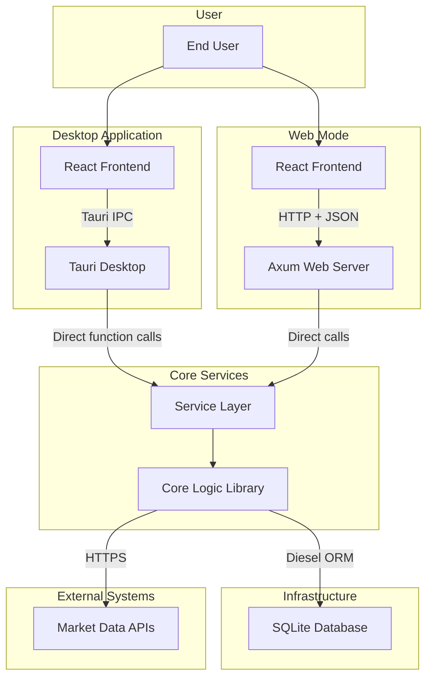

# Container Architecture

This document breaks down Wealthfolio into major containers, their
responsibilities, and how they communicate with each other.

## Overview

Wealthfolio uses a modular architecture with distinct containers for each major
component. Each container has well-defined boundaries and communicates through
specific protocols.

## Container Diagram



## Container Descriptions

### 1. React Frontend (Desktop)

**Technology**: React 19.1.1 + Vite 7.1.5 + Tailwind CSS v4

**Responsibilities**:

- Render user interface components
- Handle user interactions and form submissions
- Display portfolio data, charts, and tables
- Manage application routing
- Implement responsive design

**Key Technologies**:

- **React Query** (TanStack Query): Server state management and caching
- **React Router DOM**: Client-side routing
- **React Hook Form + Zod**: Form validation
- **Radix UI + shadcn/ui**: UI component library
- **Recharts**: Data visualization
- **i18next**: Internationalization

**Code Location**: `src/`

**Size**: ~75,000 LOC TypeScript/TSX across 501 files

---

### 2. Tauri Desktop App

**Technology**: Tauri 2.8.5 + Rust

**Responsibilities**:

- Provide native desktop window and OS integration
- Bridge between React frontend and Rust backend
- Manage application lifecycle (startup, shutdown, updates)
- Handle file system access
- Store secrets in OS keyring
- Emit and listen to system events

**Key Features**:

- **IPC (Inter-Process Communication)**: Zero-latency function calls
- **Event System**: Real-time updates (portfolio:_, market:_ events)
- **Plugin System**: File system, dialogs, shell, logging, updater
- **Cross-platform**: Windows, macOS, Linux

**Code Location**: `src-tauri/`

**Size**: ~25,000 LOC Rust

---

### 3. Service Context

**Technology**: Rust (Arc`ServiceContext>`)

**Responsibilities**:

- Dependency injection container for all services
- Manage database connection pool (r2d2)
- Initialize repositories and services
- Coordinate service lifecycles
- Handle service errors

**Components**:

- Database connection pool (SQLite)
- Repository instances (AccountRepository, ActivityRepository, etc.)
- Service instances (AccountService, PortfolioService, etc.)
- Cache instances (moka for market data)
- HTTP clients (reqwest for external APIs)

**Code Location**: `src-tauri/src/context/mod.rs`

---

### 4. Core Logic Library

**Technology**: Rust 2021 Edition

**Responsibilities**:

- Implement all business logic
- Perform complex calculations (FIFO, performance, allocation)
- Manage data persistence via repositories
- Integrate with external market data APIs
- Handle currency conversion
- Calculate portfolio metrics

**Key Services**:

| Service                 | Responsibility                                  |
| ----------------------- | ----------------------------------------------- |
| **AccountService**      | Manage investment accounts (CRUD operations)    |
| **ActivityService**     | Track trading activities and transactions       |
| **AssetService**        | Manage asset profiles and metadata              |
| **PortfolioService**    | Calculate holdings, valuations, performance     |
| **MarketDataService**   | Fetch and cache market data                     |
| **FxService**           | Handle currency exchange rates                  |
| **GoalService**         | Manage financial goals and allocations          |
| **VnAssetsSyncService** | Sync Vietnamese market data (VCI, FMarket, SJC) |

**Code Location**: `src-core/`

**Size**: ~150,000 LOC Rust

---

### 5. SQLite Database

**Technology**: SQLite 3 + Diesel ORM 2.2

**Responsibilities**:

- Persist all user data locally
- Provide ACID-compliant transactions
- Support complex queries for reporting
- Enable migration-based schema evolution

**Key Tables**:

| Table                     | Description                                    |
| ------------------------- | ---------------------------------------------- |
| `accounts`                | Investment account details                     |
| `activities`              | Trading activities (BUY, SELL, DIVIDEND, etc.) |
| `assets`                  | Asset profiles (stocks, funds, etc.)           |
| `quotes`                  | Market data quotes                             |
| `goals`                   | Financial goals                                |
| `goals_allocation`        | Account-to-goal allocations                    |
| `holdings_snapshots`      | Portfolio snapshots (FIFO)                     |
| `daily_account_valuation` | Historical valuations                          |
| `contribution_limits`     | Tax contribution limits                        |
| `settings`                | Application configuration                      |
| `vn_assets`               | Vietnamese asset catalog                       |
| `vn_historical_records`   | VN historical quotes cache                     |

**Code Location**: `src-core/migrations/` (20+ migrations)

**Size**: ~5,000 LOC SQL

---

### 6. Axum Web Server

**Technology**: Axum 0.7 + Tokio + Tower

**Responsibilities**:

- Provide HTTP API for web mode
- Handle authentication (JWT)
- Serve static frontend assets
- Provide real-time updates via SSE (Server-Sent Events)
- Generate OpenAPI documentation

**API Endpoints** (50+):

| Category    | Endpoints                                                |
| ----------- | -------------------------------------------------------- |
| Accounts    | `GET /accounts`, `POST /accounts`, `PUT /accounts/:id`   |
| Holdings    | `GET /holdings?accountId=...`                            |
| Valuations  | `GET /valuations/history`, `GET /valuations/latest`      |
| Performance | `POST /performance/history`, `POST /performance/summary` |
| Goals       | `GET /goals`, `POST /goals`, `PUT /goals`                |
| Activities  | `POST /activities/search`, `POST /activities`            |
| Market Data | `GET /market-data/search`, `POST /market-data/sync`      |
| Addons      | `GET /addons/installed`, `POST /addons/install-zip`      |
| Auth        | `POST /auth/login`, `GET /auth/status`                   |
| Events      | `GET /events/stream` (SSE)                               |

**Middleware**:

- CORS (Cross-Origin Resource Sharing)
- Compression (gzip)
- Timeout handling
- Request logging

**Code Location**: `src-server/src/`

**Size**: ~8,000 LOC Rust

---

### 7. Market Data APIs

**Technology**: External HTTP APIs

**Responsibilities**:

- Provide current and historical market data
- Supply asset profiles and metadata

**Providers**:

| Provider          | Coverage                                 | Endpoints                         |
| ----------------- | ---------------------------------------- | --------------------------------- |
| **Yahoo Finance** | Global stocks, ETFs, mutual funds        | Real-time quotes, historical data |
| **VCI (Vietcap)** | Vietnamese stocks (VN-Index, HNX, UPCoM) | Live prices, historical data      |
| **FMarket**       | Vietnamese mutual funds                  | NAV prices, fund details          |
| **SJC**           | Vietnamese gold prices                   | Gold prices by weight             |

**Integration**:

- Cached locally with TTL (Time To Live)
- Configurable update frequency
- Error handling and retry logic
- Rate limiting compliance

---

## Communication Patterns

### Desktop Mode (Tauri)

```
React Frontend
    ↓ (Tauri IPC)
Tauri Desktop
    ↓ (Direct function call)
Service Context
    ↓ (Service method)
Core Services
    ↓ (Diesel ORM)
SQLite Database
```

**Characteristics**:

- Zero network latency
- Direct function calls
- Event-driven updates (SSE-like via Tauri events)
- Single-process architecture

### Web Mode (Axum)

```
React Frontend (Browser)
    ↓ (HTTP + JSON)
Axum Web Server
    ↓ (Direct function call)
Service Context
    ↓ (Service method)
Core Services
    ↓ (Diesel ORM)
SQLite Database
```

**Characteristics**:

- Network latency (~1-5ms local)
- RESTful API design
- JWT authentication
- Real-time updates via SSE

---

## Data Flow Examples

### Portfolio Update Flow

```
User: "Update Portfolio"
    ↓
React: Call command `update_portfolio()`
    ↓ [Desktop: Tauri IPC]
    ↓ [Web: HTTP POST /portfolio/update]
Service: PortfolioService::update_portfolio()
    ↓
1. Calculate Holdings Snapshots (FIFO)
2. Calculate Total Portfolio Value
3. Update Historical Valuations
4. Calculate Performance Metrics
    ↓
Event Emitted: "portfolio:update-complete"
    ↓ [Desktop: Tauri event]
    ↓ [Web: SSE message]
React: Invalidate queries, re-render
```

### Market Data Sync Flow

```
Background Task or Manual Trigger
    ↓
Service: MarketDataService::sync_market_data()
    ↓
1. Fetch quotes from Yahoo Finance (global assets)
2. Fetch quotes from VCI/FMarket/SJC (VN assets)
3. Update quotes table in SQLite
4. Cache with TTL (e.g., 15 minutes)
    ↓
Event Emitted: "market:sync-complete"
    ↓
React: Update UI with new prices
```

---

## Scaling & Deployment

### Desktop Mode

- **Deployment**: Native installers (MSI, DMG, AppImage, DEB)
- **Updates**: Tauri updater (OTA updates)
- **Database**: SQLite file in AppData directory
- **Server**: No server required (local-only)

### Web Mode

- **Deployment**: Single Linux/Windows/macOS server
- **Containerization**: Docker support available
- **Database**: SQLite file on server
- **Server**: Axum HTTP server
- **Updates**: Rolling updates with zero downtime

---

## Security Considerations

### Desktop Mode

- **API Keys**: Stored in OS keyring (encrypted)
- **Database**: File permissions restrict access
- **Network**: Only outbound HTTPS requests to market APIs
- **Code Signing**: Binaries signed for integrity

### Web Mode

- **Authentication**: JWT tokens with expiration
- **HTTPS**: TLS required for production
- **CORS**: Configurable allowed origins
- **Secrets**: Server environment variables or keyring

---

## Next Steps

- [Component Architecture](./component-architecture) - Detailed component
  relationships
- [Data Flow](./data-flow) - Key workflow diagrams
- [Architectural Patterns](./architectural-patterns) - Design patterns used

For component-level details:

- [Frontend Component](../components/frontend) - React architecture
- [Tauri Backend](../components/tauri-backend) - Tauri integration
- [Core Services](../components/core-services) - Business logic details
- [Database Schema](../components/database-schema) - ER diagram and tables
