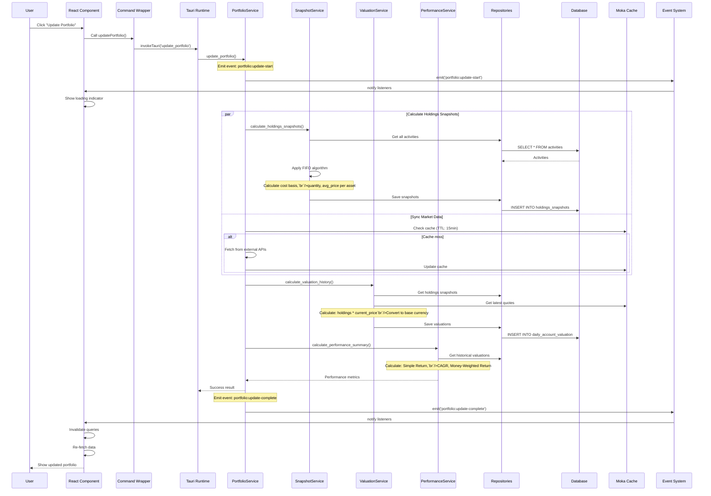
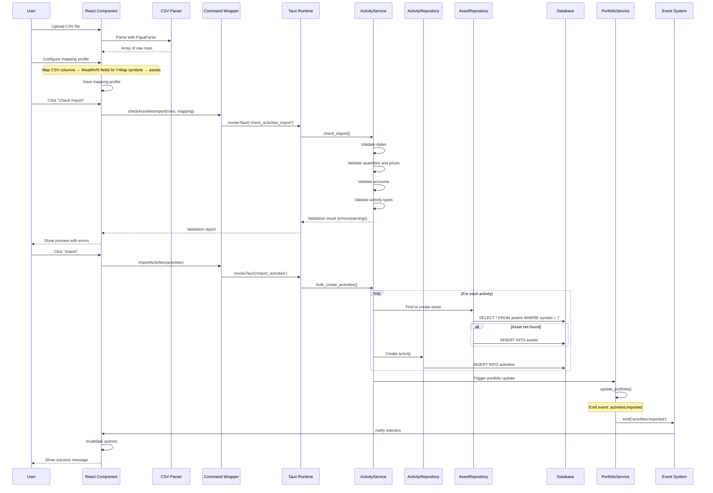
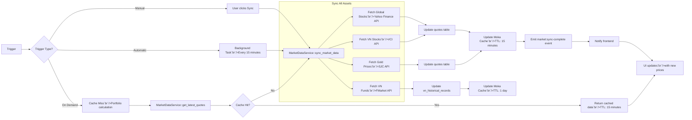
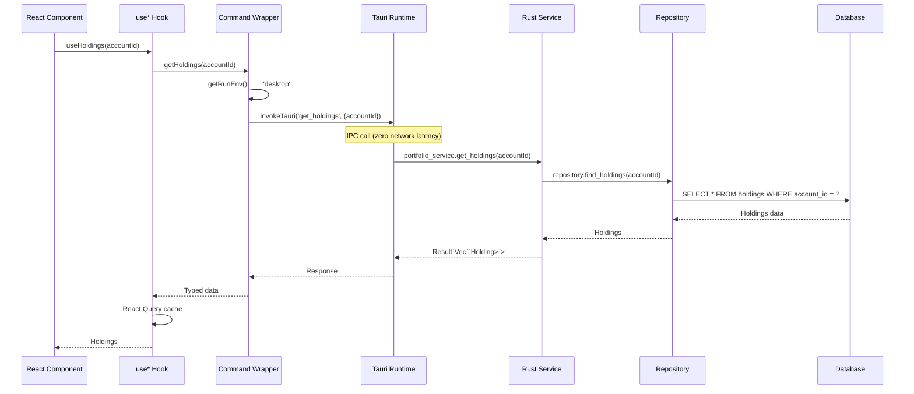
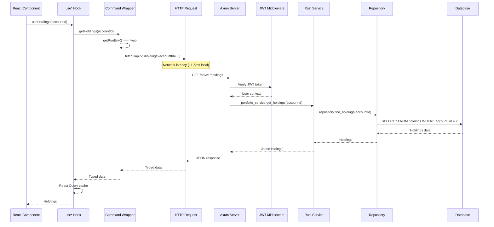
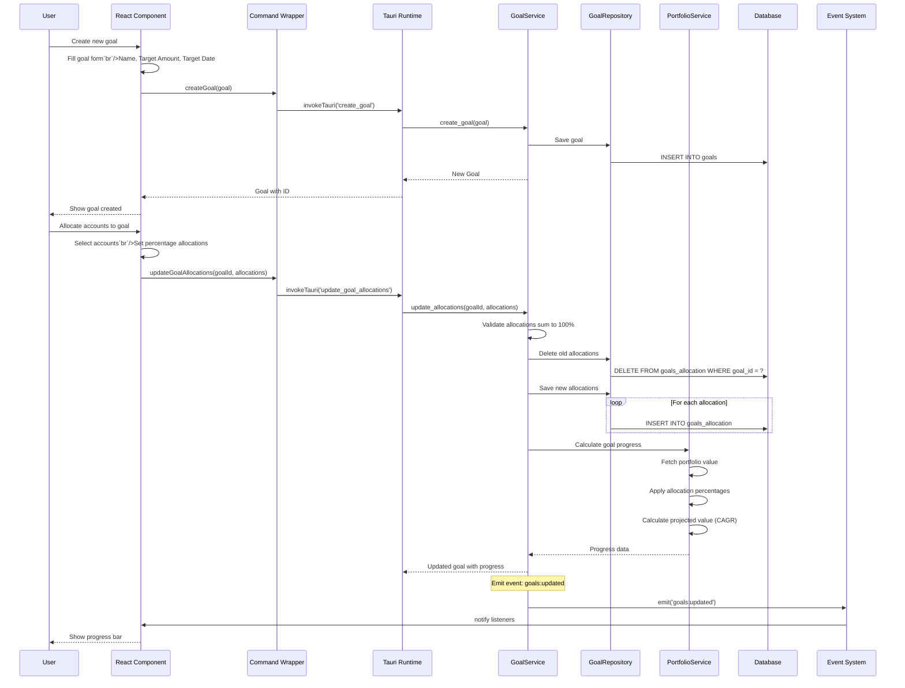
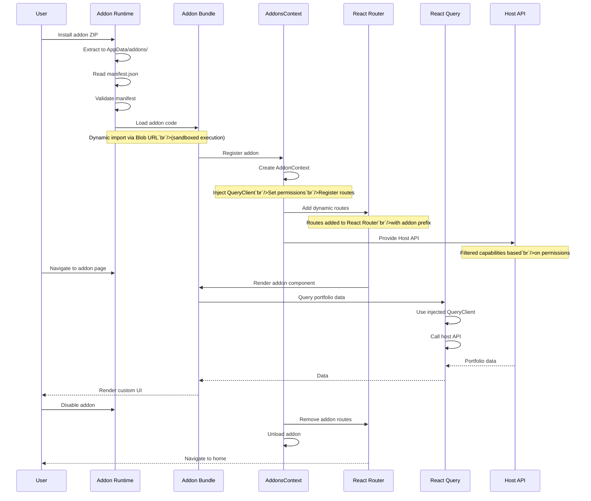
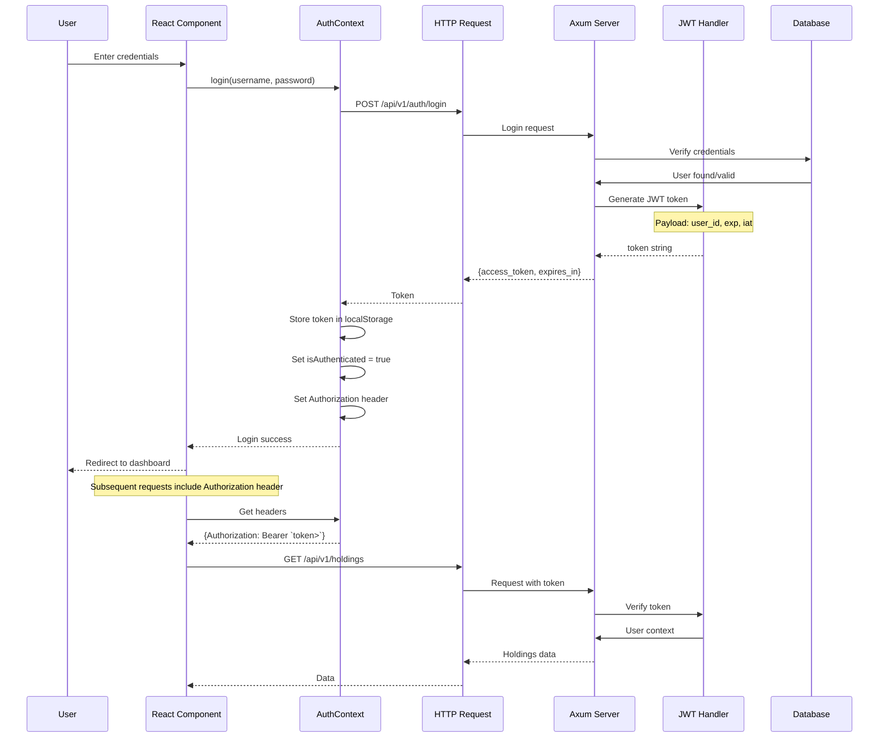
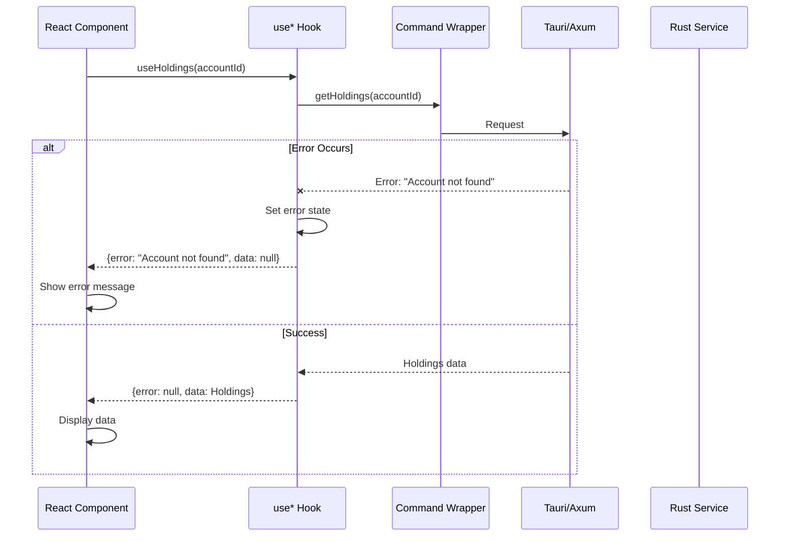

# Data Flow

This document explains how data flows through Wealthfolio's architecture, from
user interactions to database storage and back to the UI.

## Overview

Wealthfolio's data flow follows a layered architecture with clear separation of
concerns:

1. **User Interaction** → React components and forms
2. **Command Dispatch** → Runtime adapters (Tauri/Web)
3. **Backend Processing** → Services and repositories
4. **Data Persistence** → SQLite database
5. **Cache Layers** → React Query (frontend) + Moka (backend)
6. **UI Updates** → React Query invalidation + Event-driven updates

## Key Data Flows

### 1. Portfolio Update Flow

This is the most complex workflow, involving multiple services and calculations.



**Steps Explained**:

1. **Trigger**: User clicks "Update Portfolio" button
2. **Event Emission**: Backend emits `portfolio:update-start` event
3. **FIFO Calculation**: Calculate holdings snapshots using First-In-First-Out
   algorithm
4. **Market Data Sync**: Fetch latest prices (use cached if available)
5. **Valuation**: Calculate portfolio value (holdings × current price, currency
   conversion)
6. **Performance**: Calculate performance metrics (returns, CAGR, etc.)
7. **Event Emission**: Backend emits `portfolio:update-complete` event
8. **UI Update**: React Query invalidates cache and re-fetches data

---

### 2. Activity Import Flow (CSV)

Shows how users import activities from broker CSV files.



**Key Features**:

- **Mapping Profiles**: Save column mappings for future imports
- **Symbol Resolution**: Automatically map ticker symbols to assets
- **Validation**: Check data before importing
- **Bulk Insert**: Optimized database operations
- **Auto Update**: Trigger portfolio recalculation after import

---

### 3. Market Data Sync Flow

Shows how market data is fetched, cached, and used throughout the app.



**Caching Strategy**:

| Data Source     | Cache Location              | TTL    | Update Frequency |
| --------------- | --------------------------- | ------ | ---------------- |
| Global quotes   | Moka (backend)              | 15 min | Auto or manual   |
| VN stocks       | Moka + DB                   | 15 min | Auto on startup  |
| VN funds        | Moka + DB                   | 15 min | Auto on startup  |
| Gold prices     | Moka + DB                   | 15 min | Auto on startup  |
| Historical data | vn_historical_records table | N/A    | On sync          |

---

### 4. Request Flow: Desktop vs Web Mode

Shows the differences in request handling between the two runtime modes.

#### Desktop Mode (Tauri)



**Characteristics**:

- Zero network latency
- Direct function calls
- Type-safe IPC
- Same process

#### Web Mode (Axum)



**Characteristics**:

- Network latency (~1-5ms local)
- HTTP/REST protocol
- JWT authentication
- Separate processes

---

### 5. Goal Allocation Flow

Shows how financial goals and account allocations work together.



**Goal Calculation**:

```
Goal Progress = (Allocated Value / Target Amount) × 100%

Allocated Value = Σ(Account Value × Allocation %)

Projected Value = Current Value × (1 + Target Return)^years

where years = (Target Date - Current Date) / 365
```

---

### 6. Addon Loading and Execution Flow

Shows how addons are loaded and interact with the host application.



**Addon Capabilities** (via Host API):

| Capability        | Permission Required | Example                    |
| ----------------- | ------------------- | -------------------------- |
| Read holdings     | `portfolio:read`    | Fetch user's portfolio     |
| Read activities   | `activities:read`   | Access transaction history |
| Create UI routes  | `routes:create`     | Add custom pages           |
| Add sidebar items | `sidebar:add`       | Add navigation items       |
| Store data        | `storage:write`     | Persist addon settings     |
| HTTP requests     | `network:write`     | Call external APIs         |

---

### 7. Authentication Flow (Web Mode)

Shows how users authenticate in web mode.



**JWT Token Structure**:

```json
{
  "sub": "user_id",
  "exp": 1234567890,
  "iat": 1234567890
}
```

**Authentication State Management**:

- Stored in `localStorage` (persistent)
- Authorization header: `Bearer `token>``
- Automatic token refresh (if configured)
- Logout clears token and state

---

## Data Transformation Examples

### Currency Conversion

When displaying portfolio values in a different currency:

```typescript
// Frontend
const displayValue = (value: number, currency: string) => {
  const rate = exchangeRates[currency]; // Fetched from FxService
  return value * rate; // Convert to base currency
};
```

**Backend**:

```rust
// Rust
pub fn convert_to_base_currency(value: Decimal, from_currency: &str) -> Decimal {
    let rate = self.get_exchange_rate(from_currency);
    value * rate
}
```

### Performance Calculation

**Simple Return**:

```
Simple Return = (Current Value - Initial Investment) / Initial Investment × 100%
```

**CAGR (Compound Annual Growth Rate)**:

```
CAGR = (Current Value / Initial Investment)^(1 / years) - 1
```

**Money-Weighted Return** (XIRR):

```
Uses all cash flows (contributions, withdrawals) and time periods
Implemented in Rust: PerformanceService::calculate_money_weighted_return()
```

---

## Cache Invalidation Patterns

### Automatic Invalidation

| Event                       | Queries Invalidated                     |
| --------------------------- | --------------------------------------- |
| `portfolio:update-complete` | `holdings`, `valuations`, `performance` |
| `activities:imported`       | `holdings`, `activities`, `valuations`  |
| `market:sync-complete`      | `holdings`, `quotes`, `valuations`      |
| `goals:updated`             | `goals`, `goal-progress`                |

### Manual Invalidation

```typescript
// After manual update
queryClient.invalidateQueries({ queryKey: ["holdings"] });
queryClient.invalidateQueries({ queryKey: ["activities"] });
```

---

## Error Handling Flow



**Error Types**:

| Error Level | Example               | Handling                            |
| ----------- | --------------------- | ----------------------------------- |
| Validation  | "Invalid date format" | Show inline error                   |
| Not Found   | "Account not found"   | Show 404 error                      |
| Network     | "Failed to fetch"     | Retry with exponential backoff      |
| Server      | "Internal error"      | Show error message, contact support |

---

## Next Steps

- [Architectural Patterns](./architectural-patterns) - Design patterns used
- [Portfolio Calculation Workflow](../workflows/portfolio-calculation) -
  Detailed FIFO workflow
- [Activity Import Workflow](../workflows/activity-import) - CSV import details
- [Authentication Workflow](../workflows/authentication) - Web mode auth flow
