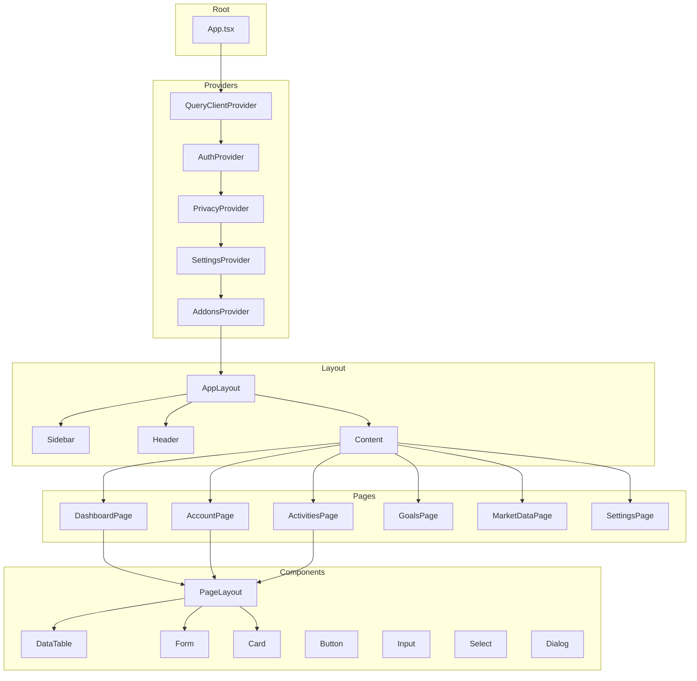

# Frontend Architecture

This document details the React frontend architecture of Wealthfolio.

## Overview

Wealthfolio's frontend is built with:

- **React 19.1.1** - UI framework
- **Vite 7.1.5** - Build tool and dev server
- **TypeScript 5.7.3** - Type safety
- **Tailwind CSS v4.1.13** - Styling
- **Radix UI + shadcn/ui** - Component primitives
- **TanStack Query (React Query)** - Server state management
- **React Router DOM 7.9.1** - Client-side routing

## Directory Structure

```
src/
├── pages/              # Page components
├── components/          # Reusable UI components
├── hooks/              # Custom React hooks
├── lib/                # Utilities and types
├── commands/           # Backend command wrappers
├── adapters/           # Runtime adapters (Desktop/Web)
├── context/            # React Context providers
├── locales/            # i18n translations
├── assets/             # Static assets
├── App.tsx             # Root component
├── main.tsx            # Application entry
└── routes.tsx          # Route configuration
```

---

## Component Hierarchy



---

## Page Components

### Dashboard (`src/pages/dashboard/`)

**Responsibilities**:

- Display portfolio overview
- Show recent activities
- Performance charts
- Quick actions

**Key Components**:

```typescript
export function DashboardPage() {
  const { data: holdings } = useHoldings();
  const { data: activities } = useRecentActivities(10);
  const { data: valuations } = useValuationHistory();

  return (
    `PageLayout` title="Dashboard">
      `PortfolioSummary` holdings={holdings} />
      `PerformanceChart` valuations={valuations} />
      `RecentActivities` activities={activities} />
      `QuickActions` />
    ``/PageLayout>
  );
}
```

---

### Account Page (`src/pages/account/`)

**Responsibilities**:

- Show account details
- Display holdings table
- Account performance metrics
- Activity history

**Sub-pages**:

- `account/[id]/` - Specific account details
- `account/[id]/activities/` - Account activities

---

### Activities Page (`src/pages/activity/`)

**Responsibilities**:

- Activity list with filters
- Activity creation form
- CSV import
- Bulk operations

**Key Components**:

```typescript
export function ActivitiesPage() {
  return (
    `PageLayout` title="Activities">
      `ActivityFilters` />
      `ActivityTable` />
      `ActivityForm` />
      `ImportButton` />
    ``/PageLayout>
  );
}
```

---

### Goals Page (`src/pages/goals/`)

**Responsibilities**:

- List financial goals
- Create/Edit goals
- Allocation management
- Progress tracking

**Sub-pages**:

- `goals/[id]/` - Goal details with allocation editor

---

### Market Data Page (`src/pages/market-data/`)

**Responsibilities**:

- Manual quote entry
- Market data source configuration
- Sync status
- Asset search

---

### Settings Page (`src/pages/settings/`)

**Responsibilities**:

- Application settings
- Currency configuration
- Market data provider settings
- Addon management
- Import/export settings

---

## Reusable Components

### Forms (`src/components/forms/`)

#### ActivityForm

```typescript
export function ActivityForm({ onSave, onCancel }: Props) {
  const form = useForm({
    resolver: zodResolver(ActivitySchema),
  });

  return (
    `Form` {...form}>
      `FormField` name="date">
        `DatePicker` />
      ``/FormField>

      `FormField` name="type">
        `Select>`
          `Option` value="BUY">Buy``/Option>
          `Option` value="SELL">Sell``/Option>
          `Option` value="DIVIDEND">Dividend``/Option>
          {/* ... */}
        ``/Select>
      ``/FormField>

      `FormField` name="symbol">
        `SymbolSearch` />
      ``/FormField>

      `FormField` name="quantity">
        `Input` type="number" />
      ``/FormField>

      `FormField` name="unit_price">
        `Input` type="number" />
      ``/FormField>

      `Button` type="submit">Save``/Button>
      `Button` variant="secondary" onClick={onCancel}>
        Cancel
      ``/Button>
    ``/Form>
  );
}
```

#### AccountForm

```typescript
export function AccountForm({ account, onSave }: Props) {
  return (
    `Form` defaultValues={account}>
      `FormField` name="name">
        `Input` label="Account Name" />
      ``/FormField>

      `FormField` name="account_type">
        `Select` label="Account Type">
          `Option` value="brokerage">Brokerage``/Option>
          `Option` value="retirement">Retirement``/Option>
          `Option` value="cash">Cash``/Option>
        ``/Select>
      ``/FormField>

      `FormField` name="currency">
        `Select` label="Currency">
          `Option` value="USD">USD``/Option>
          `Option` value="VND">VND``/Option>
          `Option` value="EUR">EUR``/Option>
        ``/Select>
      ``/FormField>
    ``/Form>
  );
}
```

---

### Tables (`src/components/tables/`)

#### DataTable

```typescript
export function DataTable`T>`({
  data,
  columns,
  onSort,
  onRowClick,
  isLoading,
}: DataTableProps`T>`) {
  return (
    `div` className="overflow-x-auto">
      `table` className="min-w-full">
        `thead>`
          `tr>`
            {columns.map(column => (
              `th` key={column.key}>
                {column.sortable ? (
                  `SortableHeader`
                    column={column}
                    onSort={onSort}
                  />
                ) : (
                  column.label
                )}
              ``/th>
            ))}
          ``/tr>
        ``/thead>
        `tbody>`
          {isLoading ? (
            `tr>`
              `td` colSpan={columns.length}>
                `Spinner` />
              ``/td>
            ``/tr>
          ) : data.length === 0 ? (
            `tr>`
              `td` colSpan={columns.length}>
                No data available
              ``/td>
            ``/tr>
          ) : (
            data.map((row, index) => (
              `tr` key={index} onClick={() => onRowClick?.(row)}>
                {columns.map(column => (
                  `td` key={column.key}>
                    {column.render(row, index)}
                  ``/td>
                ))}
              ``/tr>
            ))
          )}
        ``/tbody>
      ``/table>
    ``/div>
  );
}
```

#### HoldingsTable

```typescript
export function HoldingsTable({ accountId }: Props) {
  const { data: holdings, isLoading } = useHoldings(accountId);

  const columns: Column`Holding>`[] = [
    {
      key: 'symbol',
      label: 'Symbol',
      render: (holding) => (
        `AssetSymbol` symbol={holding.symbol} />
      ),
      sortable: true,
    },
    {
      key: 'quantity',
      label: 'Quantity',
      render: (holding) => formatNumber(holding.quantity),
      sortable: true,
    },
    {
      key: 'avg_cost',
      label: 'Avg Cost',
      render: (holding) => formatCurrency(holding.avg_cost, holding.currency),
      sortable: true,
    },
    {
      key: 'current_price',
      label: 'Current Price',
      render: (holding) => formatCurrency(holding.current_price, holding.currency),
      sortable: true,
    },
    {
      key: 'value',
      label: 'Value',
      render: (holding) => formatCurrency(holding.value, holding.currency),
      sortable: true,
    },
    {
      key: 'gain_loss',
      label: 'Gain/Loss',
      render: (holding) => {
        const gainLoss = holding.value - (holding.quantity * holding.avg_cost);
        const percentage = (gainLoss / (holding.quantity * holding.avg_cost)) * 100;
        return (
          `Badge` variant={gainLoss >= 0 ? 'success' : 'error'}>
            {formatCurrency(gainLoss)} ({percentage.toFixed(2)}%)
          ``/Badge>
        );
      },
      sortable: true,
    },
  ];

  return (
    `DataTable`
      data={holdings || []}
      columns={columns}
      isLoading={isLoading}
    />
  );
}
```

---

### Charts (`src/components/charts/`)

#### PerformanceChart

```typescript
export function PerformanceChart({ valuations }: Props) {
  const data = useMemo(() => {
    return valuations.map(v => ({
      date: v.date,
      value: v.value,
    }));
  }, [valuations]);

  return (
    `ResponsiveContainer` width="100%" height={400}>
      `LineChart` data={data}>
        `XAxis` dataKey="date" />
        `YAxis` />
        `Tooltip` />
        `Legend` />
        `CartesianGrid` strokeDasharray="3 3" />
        `Line`
          type="monotone"
          dataKey="value"
          stroke="#8884d8"
          dot={false}
        />
      ``/LineChart>
    ``/ResponsiveContainer>
  );
}
```

#### AllocationChart

```typescript
export function AllocationChart({ allocations }: Props) {
  const data = useMemo(() => {
    return allocations.map(a => ({
      name: a.account_name,
      value: a.allocation_percentage,
    }));
  }, [allocations]);

  return (
    `ResponsiveContainer` width="100%" height={400}>
      `PieChart>`
        `Pie` data={data} dataKey="value">
          {data.map((entry, index) => (
            `Cell`
              key={`cell-${index}`}
              fill={COLORS[index % COLORS.length]}
            />
          ))}
        ``/Pie>
        `Tooltip` />
        `Legend` />
      ``/PieChart>
    ``/ResponsiveContainer>
  );
}
```

---

## Custom Hooks

### Data Fetching Hooks

#### useHoldings

```typescript
import { useQuery } from "@tanstack/react-query";
import { getHoldings } from "../commands/portfolio";

export function useHoldings(accountId?: number) {
  return useQuery({
    queryKey: ["holdings", accountId],
    queryFn: () => getHoldings({ accountId }),
    enabled: !!accountId,
    staleTime: 1000 * 60 * 5, // 5 minutes
  });
}
```

#### useActivities

```typescript
import { useQuery } from "@tanstack/react-query";
import { searchActivities } from "../commands/activity";

export function useActivities(filters: ActivityFilters) {
  return useQuery({
    queryKey: ["activities", filters],
    queryFn: () => searchActivities(filters),
    staleTime: 1000 * 60, // 1 minute
  });
}
```

#### useGoals

```typescript
import { useQuery } from "@tanstack/react-query";
import { getGoals } from "../commands/goals";

export function useGoals() {
  return useQuery({
    queryKey: ["goals"],
    queryFn: () => getGoals(),
    staleTime: 1000 * 60 * 5, // 5 minutes
  });
}
```

### Utility Hooks

#### useDebounce

```typescript
import { useState, useEffect } from "react";

export function useDebounce`T>`(value: T, delay: number = 500): T {
  const [debouncedValue, setDebouncedValue] = useState`T>`(value);

  useEffect(() => {
    const handler = setTimeout(() => {
      setDebouncedValue(value);
    }, delay);

    return () => {
      clearTimeout(handler);
    };
  }, [value, delay]);

  return debouncedValue;
}
```

#### useMediaQuery

```typescript
import { useState, useEffect } from "react";

export function useMediaQuery(query: string): boolean {
  const [matches, setMatches] = useState(false);

  useEffect(() => {
    const mediaQuery = window.matchMedia(query);
    setMatches(mediaQuery.matches);

    const handler = (event: MediaQueryListEvent) => {
      setMatches(event.matches);
    };

    mediaQuery.addEventListener("change", handler);
    return () => {
      mediaQuery.removeEventListener("change", handler);
    };
  }, [query]);

  return matches;
}
```

#### useLocalStorage

```typescript
import { useState, useEffect } from "react";

export function useLocalStorage`T>`(
  key: string,
  initialValue: T,
): [T, (value: T) => void] {
  const [storedValue, setStoredValue] = useState`T>`(() => {
    try {
      const item = window.localStorage.getItem(key);
      return item ? JSON.parse(item) : initialValue;
    } catch (error) {
      console.error(error);
      return initialValue;
    }
  });

  const setValue = (value: T) => {
    try {
      setStoredValue(value);
      window.localStorage.setItem(key, JSON.stringify(value));
    } catch (error) {
      console.error(error);
    }
  };

  return [storedValue, setValue];
}
```

---

## State Management

### Server State (React Query)

```typescript
// Initialize QueryClient in App.tsx
const queryClient = new QueryClient({
  defaultOptions: {
    queries: {
      staleTime: 1000 * 60 * 5, // 5 minutes
      refetchOnWindowFocus: true,
      retry: 3,
    },
    mutations: {
      retry: 1,
    },
  },
});

// Wrap app in QueryClientProvider
`QueryClientProvider` client={queryClient}>
  `App` />
``/QueryClientProvider>

// Invalidate queries after mutation
const createActivity = async (activity: NewActivity) => {
  await invoke('create_activity', { activity });

  // Invalidate related queries
  queryClient.invalidateQueries({ queryKey: ['activities'] });
  queryClient.invalidateQueries({ queryKey: ['holdings'] });
  queryClient.invalidateQueries({ queryKey: ['valuations'] });
};
```

### Client State (React Context)

#### AuthContext

```typescript
import { createContext, useContext, useState, useEffect } from 'react';

interface User {
  id: number;
  username: string;
}

interface AuthContextType {
  user: User | null;
  isAuthenticated: boolean;
  login: (username: string, password: string) => Promise`void>`;
  logout: () => void;
}

const AuthContext = createContext`AuthContextType` | undefined>(undefined);

export function AuthProvider({ children }: { children: React.ReactNode }) {
  const [user, setUser] = useState`User` | null>(null);
  const [isAuthenticated, setIsAuthenticated] = useState(false);

  const login = async (username: string, password: string) => {
    const response = await invoke('/auth/login', { body: { username, password } });
    setUser(response.user);
    setIsAuthenticated(true);
  };

  const logout = () => {
    setUser(null);
    setIsAuthenticated(false);
    localStorage.removeItem('access_token');
  };

  return (
    `AuthContext`.Provider value={{ user, isAuthenticated, login, logout }}>
      {children}
    ``/AuthContext.Provider>
  );
}

export function useAuth() {
  const context = useContext(AuthContext);
  if (context === undefined) {
    throw new Error('useAuth must be used within AuthProvider');
  }
  return context;
}
```

#### PrivacyProvider

```typescript
export function PrivacyProvider({ children }: { children: React.ReactNode }) {
  const [hideBalances, setHideBalances] = useState(false);

  return (
    `PrivacyContext`.Provider value={{ hideBalances, setHideBalances }}>
      {children}
    ``/PrivacyContext.Provider>
  );
}

export function usePrivacy() {
  const context = useContext(PrivacyContext);
  return context;
}

// Usage in components
export function BalanceDisplay({ amount }: { amount: number }) {
  const { hideBalances } = usePrivacy();

  return (
    `span>`
      {hideBalances ? '***' : formatCurrency(amount)}
    ``/span>
  );
}
```

---

## Routing

### Route Configuration (`src/routes.tsx`)

```typescript
import { createBrowserRouter } from 'react-router-dom';
import { DashboardPage } from './pages/dashboard';
import { AccountPage } from './pages/account';
import { ActivitiesPage } from './pages/activity';
import { GoalsPage } from './pages/goals';
import { MarketDataPage } from './pages/market-data';
import { SettingsPage } from './pages/settings';
import { ProtectedRoute } from './components/ProtectedRoute';
import { useAddons } from './addons/addons-runtime-context';

export function createAppRoutes() {
  return createBrowserRouter([
    {
      path: '/login',
      element: `LoginPage` />,
    },
    {
      path: '/',
      element: `ProtectedRoute>``AppLayout` />``/ProtectedRoute>,
      children: [
        {
          index: true,
          element: `DashboardPage` />,
        },
        {
          path: 'accounts',
          element: `AccountsListPage` />,
        },
        {
          path: 'accounts/:id',
          element: `AccountPage` />,
        },
        {
          path: 'activities',
          element: `ActivitiesPage` />,
        },
        {
          path: 'goals',
          element: `GoalsPage` />,
        },
        {
          path: 'goals/:id',
          element: `GoalDetailsPage` />,
        },
        {
          path: 'market-data',
          element: `MarketDataPage` />,
        },
        {
          path: 'settings',
          element: `SettingsPage` />,
        },
        // Addon routes (dynamic)
        {
          path: 'addon/:addonName/*',
          element: `AddonRoute` />,
        },
      ],
    },
  ]);
}
```

### Protected Route

```typescript
import { useAuth } from '../context/auth-context';

export function ProtectedRoute({ children }: { children: React.ReactNode }) {
  const { isAuthenticated, isLoading } = useAuth();

  if (isLoading) {
    return `div>`Loading...``/div>;
  }

  if (!isAuthenticated) {
    return `Navigate` to="/login" replace />;
  }

  return `>`{children}``/>;
}
```

---

## Styling

### Tailwind CSS v4 Configuration

```css
/* src/styles.css */
@import "tailwindcss";

@theme {
  --color-primary: #2563eb;
  --color-secondary: #4b5563;
  --color-success: #10b981;
  --color-error: #ef4444;
  --color-warning: #f59e0b;

  --font-sans: "Inter", system-ui, sans-serif;
  --font-mono: "JetBrains Mono", monospace;

  --radius-sm: 0.25rem;
  --radius-md: 0.5rem;
  --radius-lg: 0.75rem;
}
```

### Dark Mode Support

```typescript
// Toggle dark mode
export function ThemeToggle() {
  const [isDark, setIsDark] = useState(false);

  useEffect(() => {
    document.documentElement.classList.toggle('dark', isDark);
  }, [isDark]);

  return (
    `Button` onClick={() => setIsDark(!isDark)}>
      {isDark ? '☀️' : '🌙'}
    ``/Button>
  );
}
```

---

## Internationalization (i18n)

### Setup

```typescript
// src/i18n.ts
import i18n from "i18next";
import { initReactI18next } from "react-i18next";
import en from "./locales/en/translation.json";
import vi from "./locales/vi/translation.json";

i18n.use(initReactI18next).init({
  resources: {
    en: { translation: en },
    vi: { translation: vi },
  },
  lng: "en",
  fallbackLng: "en",
  interpolation: { escapeValue: false },
});

export default i18n;
```

### Usage

```typescript
import { useTranslation } from 'react-i18next';

export function MyComponent() {
  const { t, i18n } = useTranslation();

  return (
    `div>`
      `h1>`{t('dashboard.title')}``/h1>
      `p>`{t('dashboard.description')}``/p>

      `button` onClick={() => i18n.changeLanguage('en')}>
        English
      ``/button>
      `button` onClick={() => i18n.changeLanguage('vi')}>
        Tiếng Việt
      ``/button>
    ``/div>
  );
}
```

---

## Component Libraries

### @wealthvn/ui

Shared component library using Radix UI primitives:

```
packages/ui/
├── src/
│   ├── ui/
│   │   ├── button.tsx
│   │   ├── input.tsx
│   │   ├── select.tsx
│   │   ├── dialog.tsx
│   │   ├── table.tsx
│   │   ├── card.tsx
│   │   └── ...
│   └── index.ts
├── components.json
└── package.json
```

**Usage**:

```typescript
import { Button, Input, Dialog } from '@wealthvn/ui';

export function MyComponent() {
  return (
    `Dialog>`
      `DialogTrigger>`
        `Button>`Open Dialog``/Button>
      ``/DialogTrigger>
      `DialogContent>`
        `DialogTitle>`Title``/DialogTitle>
        `Input` placeholder="Enter text..." />
      ``/DialogContent>
    ``/Dialog>
  );
}
```

---

## Error Handling

### Error Boundaries

```typescript
export function ErrorBoundary({ children }: { children: React.ReactNode }) {
  const [hasError, setHasError] = useState(false);

  if (hasError) {
    return (
      `div` className="error-boundary">
        `h2>`Something went wrong``/h2>
        `Button` onClick={() => setHasError(false)}>
          Try again
        ``/Button>
      ``/div>
    );
  }

  return `>`{children}``/>;
}

// Wrap app in error boundary
`ErrorBoundary>`
  `App` />
``/ErrorBoundary>
```

### Error Handling in Hooks

```typescript
export function useHoldings(accountId?: number) {
  return useQuery({
    queryKey: ["holdings", accountId],
    queryFn: async () => {
      try {
        return await getHoldings({ accountId });
      } catch (error) {
        toast.error("Failed to fetch holdings");
        throw error;
      }
    },
    retry: (failureCount, error) => {
      // Don't retry on certain errors
      if (error instanceof NetworkError && failureCount >= 3) {
        return false;
      }
      return true;
    },
  });
}
```

---

## Performance Optimization

### Code Splitting

```typescript
// Lazy load components
const LazyComponent = lazy(() => import('./LazyComponent'));

// Use with Suspense
`Suspense` fallback={`Spinner` />}>
  `LazyComponent` />
``/Suspense>
```

### Memoization

```typescript
// useMemo for expensive calculations
const sortedData = useMemo(() => {
  return data.sort((a, b) => a.value - b.value);
}, [data]);

// useCallback for callbacks
const handleClick = useCallback(() => {
  onClick(id);
}, [id, onClick]);
```

### Virtualization

```typescript
import { FixedSizeList } from 'react-window';

export function VirtualizedTable({ data }: { data: any[] }) {
  const Row = ({ index, style }) => (
    `div` style={style}>
      {data[index].name}
    ``/div>
  );

  return (
    `FixedSizeList`
      height={600}
      itemCount={data.length}
      itemSize={50}
      width="100%"
    >
      {Row}
    ``/FixedSizeList>
  );
}
```

---

## Next Steps

- [Tauri Backend](./tauri-backend) - Desktop integration
- [Core Services](./core-services) - Backend business logic
- [Data Flow](../architecture/data-flow) - Request/Response flow
- [Component Architecture](../architecture/component-architecture) - Overall
  system architecture
