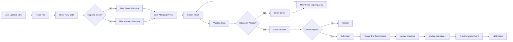
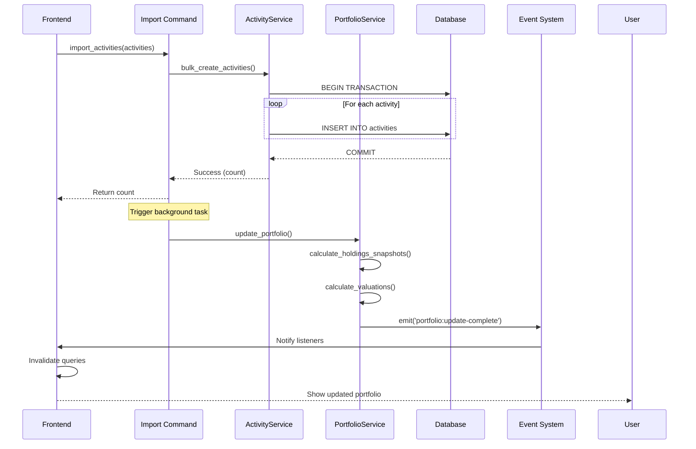

# Activity Import Workflow

This document details how Wealthfolio imports trading activities from CSV files
provided by brokers.

## Overview

The CSV import process involves multiple steps:

1. **File Upload** - User selects and uploads CSV file
2. **Parsing** - CSV file is parsed and validated
3. **Mapping Configuration** - Map CSV columns to Wealthfolio fields
4. **Symbol Resolution** - Map unknown symbols to existing assets
5. **Validation** - Validate data integrity and business rules
6. **Preview** - Show what will be imported
7. **Import** - Bulk insert activities to database
8. **Portfolio Update** - Trigger portfolio recalculation

## High-Level Flow



---

## Step 1: CSV File Upload and Parsing

### Frontend Implementation

**Component** (`src/components/activity-import/ImportForm.tsx`):

```typescript
import PapaParse from 'papaparse';

export function ActivityImportForm() {
  const [file, setFile] = useState`File` | null>(null);
  const [rows, setRows] = useState`any`[]>([]);

  const handleFileUpload = (event: ChangeEvent`HTMLInputElement>`) => {
    const selectedFile = event.target.files?.[0];
    if (!selectedFile) return;

    setFile(selectedFile);

    // Parse CSV
    PapaParse.parse(selectedFile, {
      header: true,
      skipEmptyLines: true,
      complete: (results) => {
        setRows(results.data);
      },
      error: (error) => {
        console.error('CSV parse error:', error);
      },
    });
  };

  return (
    `div>`
      `input` type="file" accept=".csv" onChange={handleFileUpload} />

      {rows.length > 0 && (
        `table>`
          `thead>`
            `tr>`
              {Object.keys(rows[0]).map(col => (
                `th` key={col}>{col}``/th>
              ))}
            ``/tr>
          ``/thead>
          `tbody>`
            {rows.slice(0, 10).map((row, i) => (
              `tr` key={i}>
                {Object.values(row).map((val, j) => (
                  `td` key={j}>{val}``/td>
                ))}
              ``/tr>
            ))}
          ``/tbody>
        ``/table>
      )}
    ``/div>
  );
}
```

---

## Step 2: Mapping Configuration

### Mapping Profile Schema

```typescript
interface ColumnMapping {
  csvColumn: string;
  wealthfolioField:
    | "date"
    | "type"
    | "symbol"
    | "quantity"
    | "price"
    | "fee"
    | "currency";
}

interface MappingProfile {
  name: string;
  broker: string;
  mappings: ColumnMapping[];
  symbolMappings: Record`string`, string>; // CSV symbol → Asset ID
}

interface ActivityTypeMapping {
  csvValue: string;
  activityType:
    | "BUY"
    | "SELL"
    | "DIVIDEND"
    | "INTEREST"
    | "FEE"
    | "DEPOSIT"
    | "WITHDRAWAL";
}
```

### Mapping UI

```typescript
export function MappingStep({ rows, onComplete }: Props) {
  const csvColumns = Object.keys(rows[0]);
  const wealthfolioFields = [
    { value: 'date', label: 'Date' },
    { value: 'type', label: 'Activity Type' },
    { value: 'symbol', label: 'Symbol' },
    { value: 'quantity', label: 'Quantity' },
    { value: 'price', label: 'Unit Price' },
    { value: 'fee', label: 'Fee' },
    { value: 'currency', label: 'Currency' },
  ];

  const [mappings, setMappings] = useState`ColumnMapping`[]>([]);
  const [typeMappings, setTypeMappings] = useState`ActivityTypeMapping`[]>([]);

  // Auto-detect mappings based on column names
  useEffect(() => {
    const autoMappings = csvColumns
      .map(col => ({
        csvColumn: col,
        wealthfolioField: detectField(col),
      }))
      .filter(m => m.wealthfolioField);
    setMappings(autoMappings);
  }, [csvColumns]);

  return (
    `div>`
      `h2>`Map CSV Columns``/h2>

      `table>`
        `thead>`
          `tr>`
            `th>`CSV Column``/th>
            `th>`Wealthfolio Field``/th>
          ``/tr>
        ``/thead>
        `tbody>`
          {csvColumns.map(col => (
            `tr` key={col}>
              `td>`{col}``/td>
              `td>`
                `select`
                  value={mappings.find(m => m.csvColumn === col)?.wealthfolioField}
                  onChange={(e) => updateMapping(col, e.target.value)}
                >
                  `option` value="">-- Ignore --``/option>
                  {wealthfolioFields.map(field => (
                    `option` key={field.value} value={field.value}>
                      {field.label}
                    ``/option>
                  ))}
                ``/select>
              ``/td>
            ``/tr>
          ))}
        ``/tbody>
      ``/table>

      `h2>`Map Activity Types``/h2>
      `TypeMappingEditor` rows={rows} mappings={typeMappings} onChange={setTypeMappings} />

      `button` onClick={() => onComplete({ mappings, typeMappings })}>
        Next: Validate
      ``/button>
    ``/div>
  );
}
```

---

## Step 3: Symbol Resolution

### Automatic Symbol Matching

```typescript
export async function resolveSymbols(
  rows: any[],
  symbolColumn: string,
): Promise`Record``string`, number>> {
  const uniqueSymbols = [...new Set(rows.map((row) => row[symbolColumn]))];
  const symbolMappings: Record`string`, number> = {};

  for (const symbol of uniqueSymbols) {
    // Try to find existing asset
    const assets = await invoke`Asset`[]>("get_assets", {
      query: symbol,
    });

    if (assets.length > 0) {
      symbolMappings[symbol] = assets[0].id;
    } else {
      // Mark as unresolved
      symbolMappings[symbol] = -1; // -1 = needs manual resolution
    }
  }

  return symbolMappings;
}
```

### Manual Resolution UI

```typescript
export function SymbolResolutionStep({
  unresolvedSymbols,
  onResolve,
}: Props) {
  const [resolutions, setResolutions] = useState`Record``string`, number>>({});

  return (
    `div>`
      `h2>`Resolve Unknown Symbols``/h2>

      `table>`
        `thead>`
          `tr>`
            `th>`CSV Symbol``/th>
            `th>`Match With``/th>
          ``/tr>
        ``/thead>
        `tbody>`
          {Object.entries(unresolvedSymbols).map(([symbol, _]) => (
            `tr` key={symbol}>
              `td>`{symbol}``/td>
              `td>`
                `AssetSelector`
                  onSelect={(asset) => setResolutions({ ...resolutions, [symbol]: asset.id })}
                />
              ``/td>
            ``/tr>
          ))}
        ``/tbody>
      ``/table>

      `button`
        onClick={() => onResolve(resolutions)}
        disabled={Object.keys(resolutions).length `` Object.keys(unresolvedSymbols).length}
      >
        Next: Validate Import
      ``/button>
    ``/div>
  );
}
```

---

## Step 4: Validation

### Backend Validation Command

**Rust** (`src-tauri/src/commands/activity.rs`):

```rust
#[tauri::command]
pub async fn check_activities_import(
    state: tauri::State``'_, Arc`ServiceContext>`>,
    rows: Vec`serde`_json::Value>,
    mappings: ImportMappings,
) -> Result`ImportValidationResult`, String> {
    let mut validation_errors = Vec::new();
    let mut warnings = Vec::new();

    for (row_index, row) in rows.iter().enumerate() {
        // 1. Validate required fields
        if let Some(date) = get_field_as_str(row, &mappings, "date") {
            match NaiveDate::parse_from_str(date, "%Y-%m-%d") {
                Ok(_) => {}
                Err(_) => validation_errors.push(ImportError {
                    row: row_index + 2, // +2 for header and 0-indexing
                    field: "date",
                    message: format!("Invalid date format: {}", date),
                }),
            }
        } else {
            validation_errors.push(ImportError {
                row: row_index + 2,
                field: "date",
                message: "Date field is required".to_string(),
            });
        }

        // 2. Validate activity type
        if let Some(csv_type) = get_field_as_str(row, &mappings, "type") {
            if !mappings.type_mappings.contains_key(csv_type) {
                validation_errors.push(ImportError {
                    row: row_index + 2,
                    field: "type",
                    message: format!("Unknown activity type: {}", csv_type),
                });
            }
        }

        // 3. Validate quantity
        if let Some(quantity) = get_field_as_decimal(row, &mappings, "quantity") {
            if quantity ``= Decimal::ZERO {
                warnings.push(ImportWarning {
                    row: row_index + 2,
                    message: "Quantity is zero or negative".to_string(),
                });
            }
        }

        // 4. Validate price
        if let Some(price) = get_field_as_decimal(row, &mappings, "price") {
            if price `` Decimal::ZERO {
                validation_errors.push(ImportError {
                    row: row_index + 2,
                    field: "price",
                    message: "Price cannot be negative".to_string(),
                });
            }
        }

        // 5. Validate account
        if let Some(account_name) = get_field_as_str(row, &mappings, "account") {
            let account = state.account_service
                .find_account_by_name(account_name)
                .await?;

            if account.is_none() {
                validation_errors.push(ImportError {
                    row: row_index + 2,
                    field: "account",
                    message: format!("Account not found: {}", account_name),
                });
            }
        }

        // 6. Validate symbol
        if let Some(symbol) = get_field_as_str(row, &mappings, "symbol") {
            let asset = state.asset_service
                .find_asset_by_symbol(symbol)
                .await?;

            if asset.is_none() {
                warnings.push(ImportWarning {
                    row: row_index + 2,
                    message: format!("Symbol not found: {}, will create new asset", symbol),
                });
            }
        }
    }

    // Check for duplicate activities (same account, date, symbol, type, quantity, price)
    let duplicates = state.activity_service
        .check_for_duplicates(&parsed_activities)
        .await?;

    for dup in duplicates {
        warnings.push(ImportWarning {
            row: dup.row_index,
            message: format!("Duplicate activity detected: {}", dup.description),
        });
    }

    Ok(ImportValidationResult {
        total_rows: rows.len(),
        valid_rows: rows.len() - validation_errors.len(),
        validation_errors,
        warnings,
    })
}
```

### Validation Results Schema

```typescript
interface ImportError {
  row: number;
  field: string;
  message: string;
}

interface ImportWarning {
  row: number;
  message: string;
}

interface ImportValidationResult {
  total_rows: number;
  valid_rows: number;
  validation_errors: ImportError[];
  warnings: ImportWarning[];
}
```

### Validation UI

```typescript
export function ValidationResultStep({ result, onConfirm, onCancel }: Props) {
  return (
    `div>`
      `h2>`Validation Results``/h2>

      `Alert` severity={result.validation_errors.length === 0 ? 'success' : 'error'}>
        {result.valid_rows} of {result.total_rows} rows are valid
      ``/Alert>

      {result.validation_errors.length > 0 && (
        `>`
          `h3>`Errors (Must Fix)``/h3>
          `table>`
            `thead>`
              `tr>`
                `th>`Row``/th>
                `th>`Field``/th>
                `th>`Error``/th>
              ``/tr>
            ``/thead>
            `tbody>`
              {result.validation_errors.map((error, i) => (
                `tr` key={i}>
                  `td>`{error.row}``/td>
                  `td>`{error.field}``/td>
                  `td>`{error.message}``/td>
                ``/tr>
              ))}
            ``/tbody>
          ``/table>

          `Button` onClick={onCancel}>Go Back to Fix``/Button>
        ``/>
      )}

      {result.warnings.length > 0 && (
        `>`
          `h3>`Warnings (Can Ignore)``/h3>
          `table>`
            `tbody>`
              {result.warnings.map((warning, i) => (
                `tr` key={i}>
                  `td>`{warning.row}``/td>
                  `td>`{warning.message}``/td>
                ``/tr>
              ))}
            ``/tbody>
          ``/table>
        ``/>
      )}

      {result.validation_errors.length === 0 && (
        `Button` onClick={() => onConfirm(result)}>
          Preview Import ({result.valid_rows} activities)
        ``/Button>
      )}
    ``/div>
  );
}
```

---

## Step 5: Preview

```typescript
export function ImportPreviewStep({ activities, onConfirm, onCancel }: Props) {
  const totalValue = activities.reduce((sum, a) => {
    return sum + (a.quantity * a.unit_price);
  }, 0);

  const byType = activities.reduce((acc, a) => {
    acc[a.activity_type] = (acc[a.activity_type] || 0) + 1;
    return acc;
  }, {} as Record`string`, number>);

  return (
    `div>`
      `h2>`Import Preview``/h2>

      `Card>`
        `Stat>`
          `Label>`Total Activities``/Label>
          `Value>`{activities.length}``/Value>
        ``/Stat>
        `Stat>`
          `Label>`Total Value``/Label>
          `Value>`{formatCurrency(totalValue)}``/Value>
        ``/Stat>
      ``/Card>

      `h3>`By Type``/h3>
      `table>`
        `tbody>`
          {Object.entries(byType).map(([type, count]) => (
            `tr` key={type}>
              `td>`{type}``/td>
              `td>`{count}``/td>
            ``/tr>
          ))}
        ``/tbody>
      ``/table>

      `h3>`Activities (First 10)``/h3>
      `table>`
        `thead>`
          `tr>`
            `th>`Date``/th>
            `th>`Type``/th>
            `th>`Symbol``/th>
            `th>`Quantity``/th>
            `th>`Price``/th>
          ``/tr>
        ``/thead>
        `tbody>`
          {activities.slice(0, 10).map((activity, i) => (
            `tr` key={i}>
              `td>`{activity.date}``/td>
              `td>`{activity.activity_type}``/td>
              `td>`{activity.symbol}``/td>
              `td>`{activity.quantity}``/td>
              `td>`{formatCurrency(activity.unit_price)}``/td>
            ``/tr>
          ))}
        ``/tbody>
      ``/table>

      `div` className="flex gap-2">
        `Button` variant="secondary" onClick={onCancel}>
          Cancel
        ``/Button>
        `Button` onClick={() => onConfirm(activities)}>
          Confirm Import
        ``/Button>
      ``/div>
    ``/div>
  );
}
```

---

## Step 6: Bulk Import

### Backend Import Command

**Rust** (`src-tauri/src/commands/activity.rs`):

```rust
#[tauri::command]
pub async fn import_activities(
    state: tauri::State``'_, Arc`ServiceContext>`>,
    activities: Vec`NewActivity>`,
) -> Result`usize`, String> {
    // Use transaction for data consistency
    let mut conn = state.db_pool.get().await
        .map_err(|e| e.to_string())?;

    conn.transaction::``_, Error, _>(|conn| {
        let mut imported_count = 0;

        for activity in activities {
            // 1. Ensure asset exists
            let asset = asset_repo.find_by_symbol(conn, &activity.symbol)?
                .unwrap_or_else(|| {
                    // Create new asset if not found
                    asset_repo.create(conn, Asset {
                        symbol: activity.symbol.clone(),
                        name: activity.symbol.clone(),
                        asset_type: AssetType::Stock,
                        data_source: DataSource::Manual,
                    })?
                });

            // 2. Ensure account exists
            let account = account_repo.find_by_id(conn, activity.account_id)?
                .ok_or(Error::NotFound("Account".to_string()))?;

            // 3. Insert activity
            let new_activity = Activity {
                account_id: activity.account_id,
                asset_id: asset.id,
                activity_type: activity.activity_type,
                quantity: activity.quantity,
                unit_price: activity.unit_price,
                fee: activity.fee.unwrap_or(Decimal::ZERO),
                currency: account.currency,
                date: activity.date,
                notes: activity.notes,
                imported_from: Some("CSV Import".to_string()),
                created_at: Utc::now(),
                updated_at: Utc::now(),
            };

            diesel::insert_into(activities::table)
                .values(&new_activity)
                .execute(conn)
                .map_err(Error::Database)?;

            imported_count += 1;
        }

        Ok(imported_count)
    }).await.map_err(|e| e.to_string())?;

    // Trigger portfolio update in background
    tokio::spawn(async move {
        if let Err(e) = state.portfolio_service.update_portfolio().await {
            error!("Failed to update portfolio after import: {}", e);
        }
    });

    Ok(activities.len())
}
```

### Frontend Import

```typescript
export async function confirmImport(activities: NewActivity[]) {
  const count = await invoke("import_activities", { activities });

  queryClient.invalidateQueries(["activities"]);
  queryClient.invalidateQueries(["holdings"]);
  queryClient.invalidateQueries(["valuations"]);

  toast.success(`Imported ${count} activities successfully`);
}
```

---

## Step 7: Portfolio Update Trigger

After successful import, portfolio is automatically updated:



---

## Error Handling

### Common Errors

| Error                 | Cause                         | Solution                                  |
| --------------------- | ----------------------------- | ----------------------------------------- |
| Invalid date format   | CSV date doesn't match format | Update mapping to use correct date format |
| Unknown activity type | Activity type not mapped      | Add type mapping                          |
| Account not found     | Account name doesn't match    | Create account or fix CSV                 |
| Symbol not found      | Asset doesn't exist           | Create asset or fix symbol                |
| Duplicate activity    | Same activity already exists  | Skip or allow duplicates                  |

### Retry Logic

```typescript
export function useActivityImport() {
  const importActivities = async (activities: NewActivity[]) => {
    try {
      await invoke("import_activities", { activities });
    } catch (error) {
      // Parse error message
      const errorMessage = parseError(error);

      // If database error, retry once
      if (errorMessage.includes("database") && !hasRetried) {
        await new Promise((resolve) => setTimeout(resolve, 1000));
        hasRetried = true;
        return importActivities(activities);
      }

      throw error;
    }
  };
}
```

---

## Performance Optimization

### Batch Operations

```rust
// Use batch insert instead of single inserts
diesel::insert_into(activities::table)
    .values(&activities)
    .execute(conn)
    .map_err(Error::Database)?;
```

### Parallel Processing

```rust
// Process multiple files in parallel
let import_tasks: Vec``_> = files
    .iter()
    .map(|file| import_file(file))
    .collect();

let results = futures::future::join_all(import_tasks).await;
```

### Progress Reporting

```rust
// Emit progress events during import
for (i, activity) in activities.iter().enumerate() {
    // ... import logic ...

    if i % 100 == 0 {
        app.emit_all("import:progress", json!({
            "imported": i,
            "total": activities.len(),
            "percentage": (i as f64 / activities.len() as f64 * 100.0)
        }))?;
    }
}
```

---

## Next Steps

- [Portfolio Calculation Workflow](./portfolio-calculation) - How portfolio is
  updated after import
- [Activity Types](../development/activities/activity-types) - Supported
  activity types
- [Data Flow](../architecture/data-flow) - Overall data flow in the system
