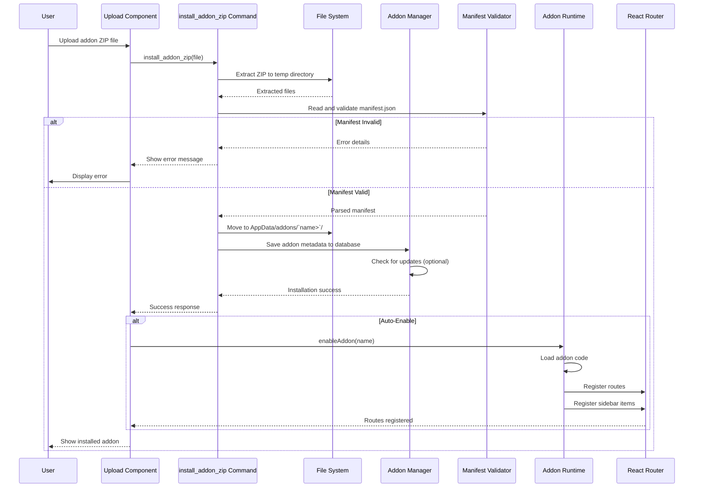

# Addon Lifecycle

This document explains the complete lifecycle of Wealthfolio addons, from
installation to execution.

## Overview

Wealthfolio addons are TypeScript packages that extend the application's
functionality. The addon lifecycle includes:

1. **Installation** - ZIP file upload and validation
2. **Loading** - Addon code extraction and parsing
3. **Validation** - Manifest and compatibility checks
4. **Enablement** - Dynamic loading and initialization
5. **Execution** - Running addon code with scoped permissions
6. **Disablement** - Unloading and cleanup

## High-Level Flow

```mermaid
flowchart LR
    A[User Installs Addon] --> B[Upload ZIP File]
    B --> C[Extract to AppData/addons/]
    C --> D[Read manifest.json]
    D --> E{Manifest Valid?}

    E -->|No| F[Show Error]
    F --> G[Cancel Installation]

    E -->|Yes| H{Compatibility Check}
    H -->|Incompatible| F
    H -->|Compatible| I[Save Addon Metadata]

    I --> J{Auto-Enable?}
    J -->|Yes| K[Enable Addon]
    J -->|No| L[Addon Installed`br`/>Disabled]

    K --> M[Load Addon Code]
    M --> N[Create Sandbox Context]
    N --> O[Call enable Context]
    O --> P[Register Routes]
    P --> Q[Register Sidebar Items]
    Q --> R[Addon Ready]

    L --> S[User Enables Later]
    S --> K

    R --> T[User Uses Addon]
    T --> U[Addon Executes`br`/>With Scoped Permissions]

    U --> V[User Disables Addon]
    V --> W[Unregister Routes]
    W --> X[Unregister Sidebar Items]
    X --> Y[Clear Cache]
    Y --> L

    L --> Z[User Uninstalls Addon]
    Z --> AA[Delete Addon Files]
    AA --> AB[Remove Metadata]
```



---

## Addon Manifest

Every addon must include a `manifest.json` file:

```json
{
  "name": "my-addon",
  "version": "1.0.0",
  "displayName": "My Addon",
  "description": "A sample addon",
  "author": "Author Name",
  "license": "MIT",
  "wealthfolio": {
    "minVersion": "1.0.0",
    "permissions": ["portfolio:read", "activities:read", "storage:write"],
    "entry": "src/index.ts",
    "icon": "icon.png",
    "routes": [
      {
        "path": "my-feature",
        "component": "./src/pages/MyFeature.tsx"
      }
    ],
    "sidebar": [
      {
        "id": "my-addon",
        "label": "My Addon",
        "icon": "activity",
        "path": "/my-feature"
      }
    ]
  }
}
```

### Manifest Schema

| Field                     | Required | Type          | Description                          |
| ------------------------- | -------- | ------------- | ------------------------------------ |
| `name`                    | Yes      | string        | Unique addon identifier (kebab-case) |
| `version`                 | Yes      | string        | SemVer version (e.g., "1.0.0")       |
| `displayName`             | Yes      | string        | Human-readable name                  |
| `description`             | No       | string        | Short description                    |
| `author`                  | No       | string        | Author name or organization          |
| `license`                 | No       | string        | License type (e.g., MIT, Apache-2.0) |
| `wealthfolio.minVersion`  | Yes      | string        | Minimum Wealthfolio version required |
| `wealthfolio.permissions` | No       | string[]      | Required permissions                 |
| `wealthfolio.entry`       | Yes      | string        | Entry point file path                |
| `wealthfolio.icon`        | No       | string        | Icon file path (16x16, PNG)          |
| `wealthfolio.routes`      | No       | Route[]       | Custom routes to register            |
| `wealthfolio.sidebar`     | No       | SidebarItem[] | Sidebar navigation items             |

---

## Installation Flow

### Sequence Diagram



### Backend Implementation

**Rust** (`src-tauri/src/commands/addon.rs`):

```rust
#[tauri::command]
pub async fn install_addon_zip(
    state: tauri::State``'_, Arc`ServiceContext>`>,
    zip_file: Vec`u8>`,
    auto_enable: bool,
) -> Result`AddonInfo`, String> {
    // 1. Create temporary directory
    let temp_dir = tempfile::tempdir()
        .map_err(|e| format!("Failed to create temp dir: {}", e))?;

    // 2. Extract ZIP to temp directory
    let cursor = std::io::Cursor::new(zip_file);
    let mut archive = zip::ZipArchive::new(cursor)
        .map_err(|e| format!("Invalid ZIP file: {}", e))?;

    archive.extract(temp_dir.path())
        .map_err(|e| format!("Failed to extract ZIP: {}", e))?;

    // 3. Read and validate manifest.json
    let manifest_path = temp_dir.path().join("manifest.json");
    let manifest_content = fs::read_to_string(&manifest_path)
        .map_err(|e| format!("No manifest.json found: {}", e))?;

    let manifest: AddonManifest = serde_json::from_str(&manifest_content)
        .map_err(|e| format!("Invalid manifest.json: {}", e))?;

    // 4. Validate manifest
    validate_manifest(&manifest)?;

    // 5. Check compatibility
    let current_version = env!("CARGO_PKG_VERSION");
    let min_version = &manifest.wealthfolio.min_version;
    if !is_version_compatible(current_version, min_version) {
        return Err(format!(
            "Addon requires Wealthfolio {} or higher, current: {}",
            min_version, current_version
        ));
    }

    // 6. Create addon directory
    let addon_dir = get_addons_directory()
        .join(&manifest.name);

    if addon_dir.exists() {
        return Err(format!("Addon '{}' is already installed", manifest.name));
    }

    fs::create_dir_all(&addon_dir)
        .map_err(|e| format!("Failed to create addon directory: {}", e))?;

    // 7. Move files from temp to addon directory
    for entry in fs::read_dir(temp_dir.path())
        .map_err(|e| format!("Failed to read temp dir: {}", e))?
    {
        let entry = entry?;
        let dest = addon_dir.join(entry.file_name());
        fs::rename(entry.path(), dest)
            .map_err(|e| format!("Failed to move file: {}", e))?;
    }

    // 8. Save addon metadata to database
    let addon_info = AddonInfo {
        id: generate_id(),
        name: manifest.name.clone(),
        version: manifest.version.clone(),
        display_name: manifest.display_name.clone(),
        description: manifest.description.clone(),
        author: manifest.author.clone(),
        installed_at: Utc::now(),
        enabled: false,
        permissions: manifest.wealthfolio.permissions.clone(),
    };

    state.addon_repository.create(addon_info.clone())
        .await
        .map_err(|e| format!("Failed to save addon metadata: {}", e))?;

    // 9. Auto-enable if requested
    if auto_enable {
        state.addon_runtime.enable(&addon_info.name)
            .await
            .map_err(|e| format!("Failed to enable addon: {}", e))?;
    }

    Ok(addon_info)
}

fn validate_manifest(manifest: &AddonManifest) -> Result``()> {
    // Check required fields
    if manifest.name.is_empty() {
        return Err("Add-on name is required".to_string());
    }

    if !is_valid_identifier(&manifest.name) {
        return Err("Add-on name must be kebab-case (e.g., my-addon)".to_string());
    }

    if manifest.version.is_empty() {
        return Err("Version is required".to_string());
    }

    if !semver::Version::parse(&manifest.version).is_ok() {
        return Err("Version must be valid SemVer (e.g., 1.0.0)".to_string());
    }

    // Validate permissions
    for permission in &manifest.wealthfolio.permissions {
        if !is_valid_permission(permission) {
            return Err(format!("Invalid permission: {}", permission));
        }
    }

    // Validate entry file exists
    // (This is checked during loading)

    Ok(())
}
```

---

## Loading and Enablement

### Frontend Implementation

**TypeScript** (`src/addons/addon-loader.ts`):

```typescript
import { AddonManifest } from "@wealthvn/addon-sdk";
import { AddonsContext } from "./addons-runtime-context";

export class AddonLoader {
  constructor(
    private runtime: AddonsContext,
    private queryClient: QueryClient,
  ) {}

  async loadAddon(addonName: string): Promise`void>` {
    // 1. Fetch addon metadata
    const addonInfo = await this.getAddonInfo(addonName);

    if (!addonInfo) {
      throw new Error(`Addon not found: ${addonName}`);
    }

    // 2. Load manifest
    const manifest = await this.loadManifest(addonName);
    await this.validatePermissions(manifest);

    // 3. Load addon code dynamically
    const addonCode = await this.loadAddonCode(addonName, manifest);

    // 4. Create sandbox context
    const context = this.createContext(manifest);

    // 5. Call addon's enable function
    if (typeof addonCode.enable === "function") {
      await addonCode.enable(context);
    }

    // 6. Register routes and sidebar items
    this.registerAddon(addonName, manifest, addonCode);

    // 7. Mark as enabled
    await this.setAddonEnabled(addonName, true);

    console.log(`Addon ${addonName} loaded successfully`);
  }

  async loadManifest(addonName: string): Promise`AddonManifest>` {
    const manifestPath = this.getAddonPath(addonName, "manifest.json");

    const response = await fetch(manifestPath);
    const manifest = await response.json();

    return manifest;
  }

  async loadAddonCode(
    addonName: string,
    manifest: AddonManifest,
  ): Promise`any>` {
    const entryPath = this.getAddonPath(addonName, manifest.wealthfolio.entry);

    // Create Blob URL for sandboxed execution
    const response = await fetch(entryPath);
    const code = await response.text();

    const blob = new Blob([code], { type: "application/javascript" });
    const blobUrl = URL.createObjectURL(blob);

    // Dynamic import from Blob URL
    const module = await import(/* @vite-ignore */ blobUrl);

    // Clean up Blob URL after import
    URL.revokeObjectURL(blobUrl);

    return module;
  }

  createContext(manifest: AddonManifest): AddonContext {
    const hostAPI = this.createHostAPI(manifest.wealthfolio.permissions);

    return {
      // Core utilities
      log: (message: string) => console.log(`[${manifest.name}]`, message),

      // Host API (filtered by permissions)
      host: hostAPI,

      // React Query client (for data fetching)
      queryClient: this.queryClient,

      // Addon metadata
      addon: {
        name: manifest.name,
        version: manifest.version,
        displayName: manifest.display_name,
      },

      // Event system
      on: (event: string, handler: Function) => {
        // Subscribe to host events
      },
      emit: (event: string, data: any) => {
        // Emit events to host
      },

      // Storage (scoped to addon)
      storage: {
        get: async (key: string) => {
          return await this.getAddonStorage(manifest.name, key);
        },
        set: async (key: string, value: any) => {
          await this.setAddonStorage(manifest.name, key, value);
        },
        remove: async (key: string) => {
          await this.removeAddonStorage(manifest.name, key);
        },
      },
    };
  }

  createHostAPI(permissions: string[]): HostAPI {
    const api: any = {};

    // Portfolio:read permission
    if (permissions.includes("portfolio:read")) {
      api.portfolio = {
        getHoldings: async (accountId?: number) => {
          return await invoke("get_holdings", { accountId });
        },
        getValuation: async (accountId?: number) => {
          return await invoke("get_valuation", { accountId });
        },
      };
    }

    // Activities:read permission
    if (permissions.includes("activities:read")) {
      api.activities = {
        search: async (filters: any) => {
          return await invoke("search_activities", filters);
        },
      };
    }

    // Storage:write permission
    if (permissions.includes("storage:write")) {
      api.storage = {
        set: async (key: string, value: any) => {
          return await invoke("set_addon_setting", { key, value });
        },
      };
    }

    // Network:write permission
    if (permissions.includes("network:write")) {
      api.http = {
        fetch: async (url: string, options: any) => {
          return await fetch(url, options);
        },
      };
    }

    return api;
  }

  registerAddon(
    addonName: string,
    manifest: AddonManifest,
    addonCode: any,
  ): void {
    // Register routes
    if (manifest.wealthfolio.routes) {
      for (const route of manifest.wealthfolio.routes) {
        this.runtime.registerRoute({
          path: `/addon/${addonName}/${route.path}`,
          component: addonCode[route.component],
        });
      }
    }

    // Register sidebar items
    if (manifest.wealthfolio.sidebar) {
      for (const item of manifest.wealthfolio.sidebar) {
        this.runtime.registerSidebarItem({
          ...item,
          path: `/addon/${addonName}/${item.path}`,
          addon: addonName,
        });
      }
    }
  }

  async unloadAddon(addonName: string): Promise`void>` {
    // 1. Unregister routes
    this.runtime.unregisterRoutes(addonName);

    // 2. Unregister sidebar items
    this.runtime.unregisterSidebarItems(addonName);

    // 3. Clear caches
    this.clearAddonCache(addonName);

    // 4. Mark as disabled
    await this.setAddonEnabled(addonName, false);

    console.log(`Addon ${addonName} unloaded`);
  }

  private getAddonPath(addonName: string, relativePath: string): string {
    // In development: use dev server
    if (import.meta.env.DEV) {
      return `http://localhost:4173/addons/${addonName}/${relativePath}`;
    }

    // In production: use file:// protocol (Tauri)
    return convertFileSrc(
      path.join(getAddonDirectory(addonName), relativePath),
    );
  }

  private async getAddonInfo(addonName: string): Promise`AddonInfo` | null> {
    return await invoke("get_addon", { name: addonName });
  }

  private async setAddonEnabled(
    addonName: string,
    enabled: boolean,
  ): Promise`void>` {
    await invoke("toggle_addon", { name: addonName, enabled });
  }

  private async validatePermissions(manifest: AddonManifest): Promise`void>` {
    // Request user permission if not granted
    const requiredPermissions = manifest.wealthfolio.permissions || [];

    for (const permission of requiredPermissions) {
      const granted = await this.checkPermission(permission);

      if (!granted) {
        const approved = await this.requestPermission(permission);

        if (!approved) {
          throw new Error(`Permission denied: ${permission}`);
        }
      }
    }
  }

  private async checkPermission(permission: string): Promise`boolean>` {
    // Check if permission is already granted
    return await invoke("check_addon_permission", { permission });
  }

  private async requestPermission(permission: string): Promise`boolean>` {
    // Show permission request dialog to user
    return await invoke("request_addon_permission", { permission });
  }

  private async getAddonStorage(addonName: string, key: string): Promise`any>` {
    return await invoke("get_addon_storage", { addon: addonName, key });
  }

  private async setAddonStorage(
    addonName: string,
    key: string,
    value: any,
  ): Promise`void>` {
    await invoke("set_addon_storage", { addon: addonName, key, value });
  }

  private async removeAddonStorage(
    addonName: string,
    key: string,
  ): Promise`void>` {
    await invoke("remove_addon_storage", { addon: addonName, key });
  }

  private clearAddonCache(addonName: string): void {
    this.runtime.clearCache(addonName);
  }
}
```

---

## Addon Runtime Context

**TypeScript** (`src/addons/addons-runtime-context.tsx`):

```typescript
import { createContext, useContext, useState, useCallback } from 'react';
import { QueryClient } from '@tanstack/react-query';

interface Route {
  path: string;
  component: React.ComponentType;
  addon: string;
}

interface SidebarItem {
  id: string;
  label: string;
  icon: string;
  path: string;
  addon: string;
}

interface AddonsContextType {
  routes: Route[];
  sidebarItems: SidebarItem[];
  registerRoute: (route: Route) => void;
  unregisterRoutes: (addon: string) => void;
  registerSidebarItem: (item: SidebarItem) => void;
  unregisterSidebarItems: (addon: string) => void;
  clearCache: (addon: string) => void;
}

const AddonsContext = createContext`AddonsContextType` | undefined>(undefined);

export function AddonsProvider({ children, queryClient }: {
  children: React.ReactNode;
  queryClient: QueryClient;
}) {
  const [routes, setRoutes] = useState`Route`[]>([]);
  const [sidebarItems, setSidebarItems] = useState`SidebarItem`[]>([]);

  const registerRoute = useCallback((route: Route) => {
    setRoutes(prev => [...prev, route]);
  }, []);

  const unregisterRoutes = useCallback((addon: string) => {
    setRoutes(prev => prev.filter(r => r.addon !== addon));
  }, []);

  const registerSidebarItem = useCallback((item: SidebarItem) => {
    setSidebarItems(prev => [...prev, item]);
  }, []);

  const unregisterSidebarItems = useCallback((addon: string) => {
    setSidebarItems(prev => prev.filter(i => i.addon !== addon));
  }, []);

  const clearCache = useCallback((addon: string) => {
    // Clear React Query cache for addon
    queryClient.invalidateQueries({ predicate: query => {
      const queryKey = query.queryKey[0] as string;
      return queryKey.startsWith(`addon:${addon}:`);
    }});
  }, [queryClient]);

  return (
    `AddonsContext`.Provider value={{
      routes,
      sidebarItems,
      registerRoute,
      unregisterRoutes,
      registerSidebarItem,
      unregisterSidebarItems,
      clearCache,
    }}>
      {children}
    ``/AddonsContext.Provider>
  );
}

export function useAddons() {
  const context = useContext(AddonsContext);
  if (context === undefined) {
    throw new Error('useAddons must be used within AddonsProvider');
  }
  return context;
}
```

---

## Addon Entry Point Example

**TypeScript** (`src/index.ts` in addon):

```typescript
import { AddonContext } from "@wealthvn/addon-sdk";
import { MyFeaturePage } from "./pages/MyFeature";
import { MyComponent } from "./components/MyComponent";

/**
 * Addon enable function - Called when addon is enabled
 */
export async function enable(context: AddonContext) {
  context.log("My Addon enabled!");

  // Example: Fetch portfolio data
  const holdings = await context.host.portfolio.getHoldings();

  context.log(`Found ${holdings.length} holdings`);

  // Example: Store addon settings
  await context.storage.set("last_visited", new Date().toISOString());

  // Example: Listen to portfolio update events
  context.on("portfolio:update-complete", (data) => {
    context.log("Portfolio updated:", data);
  });

  // Example: Custom UI component can be registered
  // (This is done by the loader based on manifest)
}

/**
 * Addon disable function - Called when addon is disabled
 */
export async function disable(context: AddonContext) {
  context.log("My Addon disabled!");

  // Clean up resources
  // Unsubscribe from events
  // Clear caches
}

/**
 * Export components for routing
 */
export { MyFeaturePage, MyComponent };
```

---

## Development Mode

Hot reload support for addon development:

```typescript
// Dev server in packages/addon-dev-tools/dev-server.mjs

import { watch } from "chokidar";
import { buildAddon } from "./scaffold.js";

export async function startDevServer(addonPath: string) {
  // Watch for file changes
  watch(addonPath, { recursive: true }, async (event, path) => {
    if (event === "change") {
      console.log(`File changed: ${path}`);

      // Rebuild addon
      await buildAddon(addonPath);

      // Notify host to reload addon
      emit("addon:rebuild", { path: addonPath });
    }
  });

  // Start development server
  const server = await createDevServer(addonPath);
  console.log(`Dev server running at http://localhost:4173`);
}

// Frontend: Listen for rebuild events
useEffect(() => {
  const unlisten = listen("addon:rebuild", async ({ path }) => {
    const addonName = getAddonNameFromPath(path);
    await addonLoader.unloadAddon(addonName);
    await addonLoader.loadAddon(addonName);
  });

  return () => unlisten.then((f) => f());
}, []);
```

---

## Permissions System

### Available Permissions

| Permission         | Description              | Capabilities                          |
| ------------------ | ------------------------ | ------------------------------------- |
| `portfolio:read`   | Read portfolio data      | Get holdings, valuations, performance |
| `portfolio:write`  | Write portfolio data     | Create activities, update holdings    |
| `activities:read`  | Read activity history    | Search activities, get details        |
| `activities:write` | Create/modify activities | Import activities, create activities  |
| `goals:read`       | Read goals               | Get goals, allocations                |
| `goals:write`      | Write goals              | Create/modify goals, allocations      |
| `storage:write`    | Persistent storage       | Store addon settings                  |
| `network:write`    | HTTP requests            | Call external APIs                    |
| `routes:create`    | Register UI routes       | Add custom pages                      |
| `sidebar:add`      | Add navigation items     | Add sidebar entries                   |

### Permission Request Flow

```typescript
// Backend command
#[tauri::command]
pub async fn request_addon_permission(
    addon_name: String,
    permission: String,
    state: tauri::State``'_, Arc`ServiceContext>`>,
) -> Result`bool`, String> {
    // Check if permission already granted
    let already_granted = state.addon_permission_repository
        .is_granted(&addon_name, &permission)
        .await?;

    if already_granted {
        return Ok(true);
    }

    // Show permission request dialog
    let approved = state
        .show_permission_dialog(addon_name.clone(), permission.clone())
        .await?;

    if approved {
        // Grant permission
        state.addon_permission_repository
            .grant(&addon_name, &permission)
            .await?;
    }

    Ok(approved)
}

// Frontend: Show permission dialog
export async function requestPermission(permission: string): Promise`boolean>` {
  const approved = await invoke('request_addon_permission', {
    addon: currentAddon.name,
    permission,
  });

  return approved;
}
```

---

## Security Considerations

### Sandbox Execution

- Addons run in separate JavaScript context
- Blob URLs prevent direct file access
- No access to DOM or window (via context)
- No access to global variables

### Permission Checks

```typescript
// Host API: Check permission before execution
function createHostAPI(permissions: string[]): HostAPI {
  const api: any = {};

  // Only expose capabilities if permission granted
  if (permissions.includes("portfolio:read")) {
    api.portfolio = {
      /* ... */
    };
  }

  return api;
}
```

### Storage Isolation

```typescript
// Storage is scoped to addon name
const storageKey = `addon:${addonName}:${key}`;

// Addons cannot access other addons' data
```

### Network Restrictions

```typescript
// Only allow specific domains (configurable)
const allowedDomains = ["https://api.example.com", "https://cdn.example.com"];

if (permissions.includes("network:write")) {
  api.http.fetch = async (url: string, options: any) => {
    const urlObj = new URL(url);

    if (!allowedDomains.some((domain) => urlObj.hostname === domain)) {
      throw new Error(`Domain not allowed: ${urlObj.hostname}`);
    }

    return await fetch(url, options);
  };
}
```

---

## Next Steps

- [Addon Development Guide](../development/addons/creating-addons) - Building
  addons
- [Addon SDK Reference](../api/typescript/addon-sdk) - SDK documentation
- [Data Flow](../architecture/data-flow) - How addons integrate with the system
- [Component Architecture](../architecture/component-architecture) - Overall
  architecture
