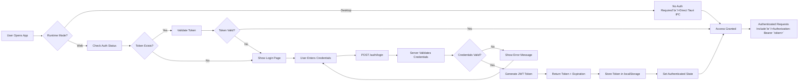
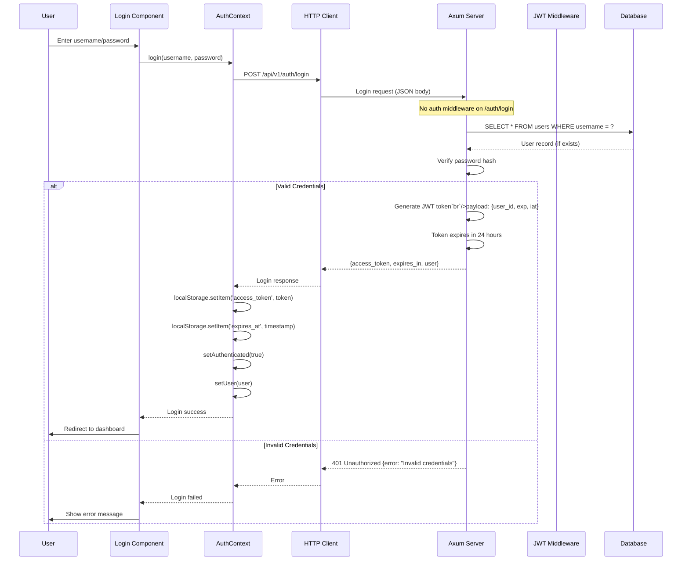

# Authentication Workflow

This document explains how Wealthfolio handles authentication in web mode (Axum
server). Note: Desktop mode (Tauri) does not require authentication.

## Overview

Authentication is only required in web mode. The process involves:

1. **User login** - Username and password authentication
2. **JWT token generation** - Server issues access token
3. **Token storage** - Client stores token in localStorage
4. **Authenticated requests** - Client includes Bearer token in requests
5. **Token validation** - Server validates token on each request
6. **Token refresh** - Optional token refresh mechanism
7. **Logout** - Client clears token

## High-Level Flow



---

## User Login Flow

### Sequence Diagram



---

## Backend Implementation

### Auth Routes

**Rust** (`src-server/src/api/auth.rs`):

```rust
use axum::{
    Json, Router,
    extract::State,
    http::StatusCode,
};
use serde::{Deserialize, Serialize};
use jsonwebtoken::{encode, Header, EncodingKey, DecodingKey};
use bcrypt::{hash, verify, DEFAULT_COST};
use time::{Duration, OffsetDateTime};

#[derive(Debug, Deserialize)]
pub struct LoginRequest {
    pub username: String,
    pub password: String,
}

#[derive(Debug, Serialize)]
pub struct LoginResponse {
    pub access_token: String,
    pub expires_in: i64, // seconds
    pub user: UserInfo,
}

#[derive(Debug, Serialize)]
pub struct UserInfo {
    pub id: i32,
    pub username: String,
}

#[derive(Debug, Serialize)]
pub struct AuthStatusResponse {
    pub authenticated: bool,
    pub user: Option`UserInfo>`,
}

/// POST /auth/login
pub async fn login(
    State(state): State`Arc``ServiceContext>`>,
    Json(req): Json`LoginRequest>`,
) -> Result`Json``LoginResponse>`, ApiError> {
    // 1. Find user by username
    let user = state.user_repository
        .find_by_username(&req.username)
        .await?
        .ok_or(ApiError::Unauthorized("Invalid username or password".to_string()))?;

    // 2. Verify password
    if !verify(&req.password, &user.password_hash)
        .map_err(|_| ApiError::Internal("Password verification failed".to_string()))?
    {
        return Err(ApiError::Unauthorized("Invalid username or password".to_string()));
    }

    // 3. Check if account is active
    if !user.is_active {
        return Err(ApiError::Forbidden("Account is disabled".to_string()));
    }

    // 4. Generate JWT token
    let expiration = OffsetDateTime::now_utc() + Duration::hours(24);
    let claims = Claims {
        sub: user.id.to_string(),
        exp: expiration.unix_timestamp(),
        iat: OffsetDateTime::now_utc().unix_timestamp(),
    };

    let token = encode(
        &Header::default(),
        &claims,
        &EncodingKey::from_secret(state.jwt_secret.as_ref()),
    ).map_err(|_| ApiError::Internal("Token generation failed".to_string()))?;

    // 5. Return response
    Ok(Json(LoginResponse {
        access_token: token,
        expires_in: Duration::hours(24).whole_seconds(),
        user: UserInfo {
            id: user.id,
            username: user.username,
        },
    }))
}

/// GET /auth/status
pub async fn status(
    State(state): State`Arc``ServiceContext>`>,
    claims: Claims, // Extracted by middleware
) -> Result`Json``AuthStatusResponse>`, ApiError> {
    // Fetch user from claims
    let user = state.user_repository
        .find_by_id(claims.sub.parse().unwrap())
        .await?;

    Ok(Json(AuthStatusResponse {
        authenticated: true,
        user: Some(UserInfo {
            id: user.id,
            username: user.username,
        }),
    }))
}

pub fn create_router() -> Router`Arc``ServiceContext>`> {
    Router::new()
        .route("/login", post(login))
        .route("/status", get(status))
}
```

### JWT Claims

```rust
use serde::{Deserialize, Serialize};

#[derive(Debug, Serialize, Deserialize)]
pub struct Claims {
    pub sub: String, // User ID
    pub exp: i64,    // Expiration time (Unix timestamp)
    pub iat: i64,    // Issued at (Unix timestamp)
}
```

### JWT Middleware

**Rust** (`src-server/src/middleware/auth.rs`):

```rust
use axum::{
    extract::Request,
    middleware::Next,
    response::Response,
    http::{HeaderMap, StatusCode},
};
use jsonwebtoken::{decode, Validation, DecodingKey};
use crate::auth::Claims;

pub async fn auth_middleware(
    State(state): State`Arc``ServiceContext>`>,
    headers: HeaderMap,
    request: Request,
    next: Next,
) -> Result`Response`, StatusCode> {
    // Skip auth for login endpoint
    if request.uri().path() == "/api/v1/auth/login" {
        return Ok(next.run(request).await);
    }

    // Extract Authorization header
    let auth_header = headers
        .get("authorization")
        .and_then(|h| h.to_str().ok())
        .ok_or(StatusCode::UNAUTHORIZED)?;

    // Parse Bearer token
    if !auth_header.starts_with("Bearer ") {
        return Err(StatusCode::UNAUTHORIZED);
    }

    let token = &auth_header[7..]; // Remove "Bearer " prefix

    // Decode and validate token
    let claims = decode::`Claims>`(
        token,
        &DecodingKey::from_secret(state.jwt_secret.as_ref()),
        &Validation::default(),
    )
    .map_err(|_| StatusCode::UNAUTHORIZED)?
    .claims;

    // Check token expiration
    let now = time::OffsetDateTime::now_utc().unix_timestamp();
    if claims.exp `` now {
        return Err(StatusCode::UNAUTHORIZED);
    }

    // Store claims in request extensions for use in handlers
    // This requires using axum's Extension extractor
    // ...

    Ok(next.run(request).await)
}

// Alternative: Create request extension for claims
pub async fn require_auth(
    Extension(claims): Extension`Claims>`,
) -> Result`Claims`, StatusCode> {
    Ok(claims)
}
```

### User Repository

```rust
use bcrypt::{hash, DEFAULT_COST};

pub struct UserRepository {
    db_pool: Arc`Pool>`,
}

impl UserRepository {
    pub async fn create_user(
        &self,
        username: &str,
        password: &str,
    ) -> Result`User>` {
        let password_hash = hash(password, DEFAULT_COST)?;

        let mut conn = self.db_pool.get().await?;

        let user = diesel::insert_into(users::table)
            .values(NewUser {
                username: username.to_string(),
                password_hash,
                is_active: true,
                created_at: Utc::now(),
            })
            .returning(User::as_returning())
            .get_result(&mut conn)?;

        Ok(user)
    }

    pub async fn find_by_username(
        &self,
        username: &str,
    ) -> Result`Option``User>`> {
        let mut conn = self.db_pool.get().await?;

        let user = users::table
            .filter(users::username.eq(username))
            .first::`User>`(&mut conn)
            .optional()?;

        Ok(user)
    }

    pub async fn find_by_id(&self, id: i32) -> Result`User>` {
        let mut conn = self.db_pool.get().await?;

        let user = users::table
            .filter(users::id.eq(id))
            .first::`User>`(&mut conn)?;

        Ok(user)
    }
}
```

---

## Frontend Implementation

### Auth Context

**TypeScript** (`src/context/auth-context.tsx`):

```typescript
import { createContext, useContext, useState, useEffect } from 'react';
import { invoke } from '../adapters';

interface User {
  id: number;
  username: string;
}

interface AuthContextType {
  user: User | null;
  isAuthenticated: boolean;
  isLoading: boolean;
  login: (username: string, password: string) => Promise`void>`;
  logout: () => void;
  checkAuth: () => Promise`void>`;
}

const AuthContext = createContext`AuthContextType` | undefined>(undefined);

export function AuthProvider({ children }: { children: React.ReactNode }) {
  const [user, setUser] = useState`User` | null>(null);
  const [isAuthenticated, setIsAuthenticated] = useState(false);
  const [isLoading, setIsLoading] = useState(true);

  // Check auth status on mount
  useEffect(() => {
    checkAuth();
  }, []);

  const checkAuth = async () => {
    try {
      const token = localStorage.getItem('access_token');
      const expiresAt = localStorage.getItem('expires_at');

      if (!token) {
        setIsAuthenticated(false);
        setUser(null);
        setIsLoading(false);
        return;
      }

      // Check if token is expired
      if (expiresAt && Date.now() > parseInt(expiresAt)) {
        logout();
        return;
      }

      // Verify token with server
      const status = await invoke``{ authenticated: boolean; user?: User }>(
        '/auth/status',
        { headers: { Authorization: `Bearer ${token}` } }
      );

      if (status.authenticated && status.user) {
        setIsAuthenticated(true);
        setUser(status.user);
      } else {
        logout();
      }
    } catch (error) {
      console.error('Auth check failed:', error);
      logout();
    } finally {
      setIsLoading(false);
    }
  };

  const login = async (username: string, password: string) => {
    try {
      const response = await invoke``{
        access_token: string;
        expires_in: number;
        user: User;
      }>('/auth/login', {
        method: 'POST',
        body: { username, password },
      });

      // Store token
      localStorage.setItem('access_token', response.access_token);
      localStorage.setItem('expires_at', (Date.now() + response.expires_in * 1000).toString());

      // Update state
      setIsAuthenticated(true);
      setUser(response.user);
    } catch (error) {
      console.error('Login failed:', error);
      throw error;
    }
  };

  const logout = () => {
    localStorage.removeItem('access_token');
    localStorage.removeItem('expires_at');
    setIsAuthenticated(false);
    setUser(null);
  };

  return (
    `AuthContext`.Provider value={{ user, isAuthenticated, isLoading, login, logout, checkAuth }}>
      {children}
    ``/AuthContext.Provider>
  );
}

export function useAuth() {
  const context = useContext(AuthContext);
  if (context === undefined) {
    throw new Error('useAuth must be used within AuthProvider');
  }
  return context;
}
```

### Login Component

**TypeScript** (`src/components/auth/LoginForm.tsx`):

```typescript
import { useState } from 'react';
import { useAuth } from '../../context/auth-context';

export function LoginForm() {
  const { login } = useAuth();
  const [username, setUsername] = useState('');
  const [password, setPassword] = useState('');
  const [error, setError] = useState('');
  const [isLoading, setIsLoading] = useState(false);

  const handleSubmit = async (e: React.FormEvent) => {
    e.preventDefault();
    setError('');
    setIsLoading(true);

    try {
      await login(username, password);
      // Redirect to dashboard (handled by router)
      window.location.href = '/';
    } catch (err: any) {
      setError(err.message || 'Login failed');
    } finally {
      setIsLoading(false);
    }
  };

  return (
    `form` onSubmit={handleSubmit}>
      `h1>`Sign In``/h1>

      {error && `div` className="error">{error}``/div>}

      `div>`
        `label` htmlFor="username">Username``/label>
        `input`
          id="username"
          type="text"
          value={username}
          onChange={(e) => setUsername(e.target.value)}
          required
          autoFocus
        />
      ``/div>

      `div>`
        `label` htmlFor="password">Password``/label>
        `input`
          id="password"
          type="password"
          value={password}
          onChange={(e) => setPassword(e.target.value)}
          required
        />
      ``/div>

      `button` type="submit" disabled={isLoading}>
        {isLoading ? 'Signing in...' : 'Sign In'}
      ``/button>
    ``/form>
  );
}
```

### Authenticated HTTP Client

**TypeScript** (`src/adapters/web.ts`):

```typescript
export async function invokeWeb`T>`(
  endpoint: string,
  options?: {
    method?: string;
    body?: any;
    headers?: Record`string`, string>;
  },
): Promise`T>` {
  const token = localStorage.getItem("access_token");

  const headers: Record`string`, string> = {
    "Content-Type": "application/json",
    ...options?.headers,
  };

  // Add Bearer token if available (except for login endpoint)
  if (token && !endpoint.includes("/auth/login")) {
    headers["Authorization"] = `Bearer ${token}`;
  }

  const response = await fetch(`/api/v1${endpoint}`, {
    method: options?.method || "GET",
    headers,
    body: options?.body ? JSON.stringify(options.body) : undefined,
  });

  if (!response.ok) {
    if (response.status === 401) {
      // Clear invalid token
      localStorage.removeItem("access_token");
      localStorage.removeItem("expires_at");
      // Redirect to login
      window.location.href = "/login";
    }
    throw new Error(`HTTP ${response.status}: ${response.statusText}`);
  }

  return response.json();
}
```

### Protected Routes

**TypeScript** (`src/routes.tsx`):

```typescript
import { Navigate } from 'react-router-dom';
import { useAuth } from './context/auth-context';

function ProtectedRoute({ children }: { children: React.ReactNode }) {
  const { isAuthenticated, isLoading } = useAuth();

  if (isLoading) {
    return `div>`Loading...``/div>;
  }

  if (!isAuthenticated) {
    return `Navigate` to="/login" replace />;
  }

  return `>`{children}``/>;
}

// Usage in routes
const routes = [
  {
    path: '/login',
    element: `LoginForm` />,
  },
  {
    path: '/',
    element: `ProtectedRoute>``Dashboard` />``/ProtectedRoute>,
  },
  // ... other routes
];
```

---

## Logout Flow

### Frontend

```typescript
// In AuthContext
const logout = () => {
  localStorage.removeItem('access_token');
  localStorage.removeItem('expires_at');
  setIsAuthenticated(false);
  setUser(null);

  // Redirect to login
  window.location.href = '/login';
};

// In component
`Button` onClick={() => auth.logout()}>
  Logout
``/Button>
```

### Backend (Optional)

```rust
// Optional: POST /auth/logout
pub async fn logout(
    State(state): State`Arc``ServiceContext>`>,
    claims: Claims,
) -> Result`Json```()>, ApiError> {
    // Option 1: Add token to blacklist (requires Redis)
    // state.token_blacklist.add(claims.jti);

    // Option 2: Just rely on client-side removal (simpler)
    // No server-side action needed

    Ok(Json(()))
}
```

---

## Token Refresh (Optional)

If you want to implement automatic token refresh:

### Backend

```rust
// POST /auth/refresh
pub async fn refresh_token(
    State(state): State`Arc``ServiceContext>`>,
    Json(req): Json`RefreshRequest>`,
) -> Result`Json``LoginResponse>`, ApiError> {
    // Decode and validate existing token
    let old_claims = decode::`Claims>`(
        &req.refresh_token,
        &DecodingKey::from_secret(state.jwt_secret.as_ref()),
        &Validation::default(),
    ).map_err(|_| ApiError::Unauthorized("Invalid refresh token".to_string()))?
    .claims;

    // Check if refresh token is expired
    let now = OffsetDateTime::now_utc().unix_timestamp();
    if old_claims.exp `` now {
        return Err(ApiError::Unauthorized("Refresh token expired".to_string()));
    }

    // Generate new access token
    let new_expiration = OffsetDateTime::now_utc() + Duration::hours(24);
    let new_claims = Claims {
        sub: old_claims.sub.clone(),
        exp: new_expiration.unix_timestamp(),
        iat: now,
    };

    let new_token = encode(
        &Header::default(),
        &new_claims,
        &EncodingKey::from_secret(state.jwt_secret.as_ref()),
    ).map_err(|_| ApiError::Internal("Token generation failed".to_string()))?;

    Ok(Json(LoginResponse {
        access_token: new_token,
        expires_in: Duration::hours(24).whole_seconds(),
        user: UserInfo { /* ... */ },
    }))
}
```

### Frontend

```typescript
// Axios interceptor to auto-refresh
api.interceptors.response.use(
  (response) => response,
  async (error) => {
    if (error.response?.status === 401) {
      try {
        // Try to refresh token
        const response = await invokeWeb("/auth/refresh", {
          body: { refresh_token: localStorage.getItem("refresh_token") },
        });

        localStorage.setItem("access_token", response.access_token);

        // Retry original request
        error.config.headers.Authorization = `Bearer ${response.access_token}`;
        return api.request(error.config);
      } catch (refreshError) {
        // Refresh failed, logout
        auth.logout();
        return Promise.reject(refreshError);
      }
    }
    return Promise.reject(error);
  },
);
```

---

## Security Considerations

### Password Hashing

```rust
// Use bcrypt for password hashing
use bcrypt::{hash, verify, DEFAULT_COST};

// Hash password on user creation
let password_hash = hash(password, DEFAULT_COST)?;

// Verify password on login
if !verify(password, &user.password_hash)? {
    return Err(ApiError::Unauthorized("Invalid credentials".to_string()));
}
```

### JWT Secret

```rust
// Load JWT secret from environment variable
let jwt_secret = std::env::var("JWT_SECRET")
    .unwrap_or_else(|_| {
        // Generate random secret if not set (dev mode only!)
        use rand::Rng;
        let secret: String = rand::thread_rng()
            .sample_iter(&rand::distributions::Alphanumeric)
            .take(32)
            .map(char::from)
            .collect();
        warn!("Using randomly generated JWT secret. Set JWT_SECRET in production!");
        secret
    });
```

### HTTPS Only (Production)

```rust
// Enforce HTTPS in production
if cfg!(not(debug_assertions)) && !request_is_https() {
    return Err(ApiError::Forbidden("HTTPS required".to_string()));
}
```

### Token Expiration

```rust
// Set reasonable token expiration (24 hours)
let expiration = OffsetDateTime::now_utc() + Duration::hours(24);

// Or shorter for high-security apps (1 hour)
let expiration = OffsetDateTime::now_utc() + Duration::hours(1);
```

### SameSite Cookies (Optional)

If using cookies instead of localStorage:

```rust
SetCookie::new("access_token", token)
    .http_only(true)
    .secure(true)
    .same_site(SameSite::Strict)
    .max_age(Duration::hours(24))
```

---

## Troubleshooting

### Common Issues

| Issue                     | Cause              | Solution                          |
| ------------------------- | ------------------ | --------------------------------- |
| 401 on every request      | Token not sent     | Check Authorization header format |
| Token invalid immediately | Clock skew         | Sync system time                  |
| Cannot login after logout | Token not cleared  | Clear localStorage                |
| CORS errors               | Origin not allowed | Configure CORS middleware         |

### Debugging

```typescript
// Log auth state
console.log("Token:", localStorage.getItem("access_token"));
console.log("Expires:", localStorage.getItem("expires_at"));
console.log("Is authenticated:", auth.isAuthenticated);
```

```rust
// Log authentication attempts
info!("Login attempt for username: {}", username);
info!("JWT claims: {:?}", claims);
```

---

## Next Steps

- [Data Flow](../architecture/data-flow) - Overall data flow in the system
- [Web Deployment](../deployment/web/README.md) - Web mode deployment guide
- [Security](../deployment/security) - Security best practices
