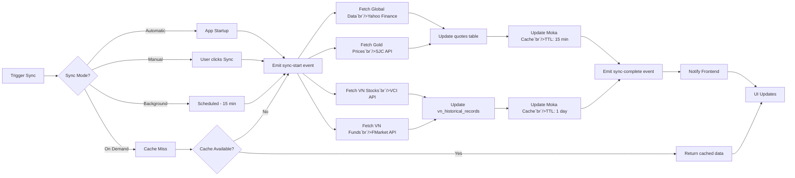

# Market Data Synchronization Workflow

This document explains how Wealthfolio synchronizes market data from multiple
external providers.

## Overview

Wealthfolio fetches market data from multiple providers:

- **Yahoo Finance** - Global stocks, ETFs, mutual funds
- **VCI (Vietcap)** - Vietnamese stocks (VN-Index, HNX, UPCoM)
- **FMarket** - Vietnamese mutual funds
- **SJC** - Vietnamese gold prices

The sync process involves:

1. **Automatic sync on startup** - Vietnamese market data syncs automatically
2. **Manual sync trigger** - User can trigger manual sync
3. **Background sync** - Periodic updates every 15 minutes
4. **Caching** - Data is cached to reduce API calls
5. **Error handling** - Fallback and retry mechanisms

## High-Level Flow



---

## Market Data Providers

### Provider Configuration

```rust
pub struct MarketDataConfig {
    pub yahoo_finance_enabled: bool,
    pub vci_enabled: bool,
    pub vci_api_key: Option`String>`,
    pub fmarket_enabled: bool,
    pub sjc_enabled: bool,
    pub auto_sync_on_startup: bool,
    pub sync_interval_minutes: u64,
}
```

### Provider Traits

```rust
#[async_trait]
pub trait MarketDataProvider: Send + Sync {
    fn name(&self) -> &'static str;

    /// Fetch current price for a single symbol
    async fn fetch_quote(&self, symbol: &str) -> Result`Quote>`;

    /// Fetch historical data for date range
    async fn fetch_history(&self, symbol: &str, start: NaiveDate, end: NaiveDate)
        -> Result`Vec``Quote>`>;

    /// Search for symbols matching query
    async fn search_symbols(&self, query: &str) -> Result`Vec``Asset>`>;

    /// Get supported asset types
    fn supported_asset_types(&self) -> Vec`AssetType>`;
}
```

---

## Provider Implementations

### 1. Yahoo Finance Provider

**Rust** (`src-core/src/market_data/providers/yahoo.rs`):

```rust
use reqwest::Client;
use serde::Deserialize;

pub struct YahooFinanceProvider {
    client: Client,
}

impl YahooFinanceProvider {
    pub fn new() -> Self {
        Self {
            client: Client::new(),
        }
    }

    async fn fetch_from_api(&self, symbol: &str) -> Result`YahooQuote>` {
        let url = format!(
            "https://query1.finance.yahoo.com/v8/finance/chart/{}",
            symbol
        );

        let response = self.client
            .get(&url)
            .header("User-Agent", "Mozilla/5.0")
            .send()
            .await?;

        let data: YahooResponse = response.json().await?;

        Ok(data.chart.result[0].meta)
    }
}

#[async_trait]
impl MarketDataProvider for YahooFinanceProvider {
    fn name(&self) -> &'static str {
        "Yahoo Finance"
    }

    async fn fetch_quote(&self, symbol: &str) -> Result`Quote>` {
        let yahoo_quote = self.fetch_from_api(symbol).await?;

        Ok(Quote {
            symbol: symbol.to_string(),
            price: Decimal::from_str(&yahoo_quote.regular_market_price.to_string())?,
            currency: yahoo_quote.currency,
            timestamp: Utc::now(),
            source: "Yahoo Finance".to_string(),
        })
    }

    async fn fetch_history(
        &self,
        symbol: &str,
        start: NaiveDate,
        end: NaiveDate,
    ) -> Result`Vec``Quote>`> {
        let url = format!(
            "https://query1.finance.yahoo.com/v8/finance/chart/{}?period1={}&period2={}&interval=1d",
            symbol,
            start.and_hms(0, 0, 0).and_utc().timestamp(),
            end.and_hms(0, 0, 0).and_utc().timestamp()
        );

        let response = self.client.get(&url).send().await?;
        let data: YahooResponse = response.json().await?;

        let quotes = data.chart.result[0].indicators.quote[0].close
            .iter()
            .zip(data.chart.result[0].timestamp.iter())
            .map(|(price, timestamp)| Quote {
                symbol: symbol.to_string(),
                price: Decimal::from_str(&price.unwrap().to_string())?,
                currency: "USD".to_string(),
                timestamp: Utc.timestamp_opt(*timestamp, 0).unwrap(),
                source: "Yahoo Finance".to_string(),
            })
            .collect();

        Ok(quotes)
    }

    async fn search_symbols(&self, query: &str) -> Result`Vec``Asset>`> {
        let url = format!(
            "https://query1.finance.yahoo.com/v1/finance/search?q={}&quotesCount=10",
            query
        );

        let response = self.client.get(&url).send().await?;
        let data: YahooSearchResponse = response.json().await?;

        let assets = data.quotes.iter().map(|quote| Asset {
            symbol: quote.symbol.clone(),
            name: quote.shortname.clone().unwrap_or(quote.symbol.clone()),
            asset_type: if quote.quote_type == "ETF" {
                AssetType::Etf
            } else {
                AssetType::Stock
            },
            currency: "USD".to_string(),
            exchange: quote.exchange.clone(),
            data_source: DataSource::YahooFinance,
            ..Default::default()
        }).collect();

        Ok(assets)
    }

    fn supported_asset_types(&self) -> Vec`AssetType>` {
        vec![AssetType::Stock, AssetType::Etf, AssetType::MutualFund]
    }
}
```

---

### 2. VCI Provider (Vietnamese Stocks)

**Rust** (`src-core/src/market_data/providers/vci.rs`):

```rust
pub struct VciProvider {
    api_key: String,
    base_url: String,
    client: Client,
}

impl VciProvider {
    pub fn new(api_key: String) -> Self {
        Self {
            api_key,
            base_url: "https://apipubaws.tcbs.com.vn".to_string(),
            client: Client::new(),
        }
    }

    async fn fetch_vn_stocks(&self) -> Result`Vec``VnStock>`> {
        let url = format!("{}/stock/v2/stock/listing", self.base_url);

        let response = self.client
            .get(&url)
            .header("Cookie", &format!("invest_id={}", self.api_key))
            .send()
            .await?;

        let data: VciListingResponse = response.json().await?;
        Ok(data.data)
    }

    async fn fetch_stock_price(&self, symbol: &str) -> Result`Decimal>` {
        let url = format!(
            "{}/stock-insider/v2/stock/realtime-quote ticker_code={}",
            self.base_url,
            symbol
        );

        let response = self.client.get(&url).send().await?;
        let data: VciQuoteResponse = response.json().await?;

        Ok(Decimal::from_str(&data.price.to_string())?)
    }
}

#[async_trait]
impl MarketDataProvider for VciProvider {
    fn name(&self) -> &'static str {
        "VCI (Vietcap)"
    }

    async fn fetch_quote(&self, symbol: &str) -> Result`Quote>` {
        let price = self.fetch_stock_price(symbol).await?;

        Ok(Quote {
            symbol: symbol.to_string(),
            price,
            currency: "VND".to_string(),
            timestamp: Utc::now(),
            source: "VCI".to_string(),
        })
    }

    async fn fetch_history(
        &self,
        symbol: &str,
        start: NaiveDate,
        end: NaiveDate,
    ) -> Result`Vec``Quote>`> {
        // Check vn_historical_records cache first
        let cached = self.get_cached_history(symbol, start, end).await?;

        if !cached.is_empty() {
            return Ok(cached);
        }

        let url = format!(
            "{}/stock-insider/v2/stock/historical-price ticker_code={}&from={}&to={}",
            self.base_url,
            symbol,
            start.format("%Y-%m-%d"),
            end.format("%Y-%m-%d")
        );

        let response = self.client.get(&url).send().await?;
        let data: VciHistoryResponse = response.json().await?;

        let quotes = data.data.iter().map(|day| Quote {
            symbol: symbol.to_string(),
            price: Decimal::from_str(&day.close.to_string())?,
            currency: "VND".to_string(),
            timestamp: NaiveDate::parse_from_str(&day.date, "%Y-%m-%d")?
                .and_hms(0, 0, 0)
                .and_utc(),
            source: "VCI".to_string(),
        }).collect();

        // Cache in vn_historical_records
        self.cache_history(symbol, &quotes).await?;

        Ok(quotes)
    }

    async fn search_symbols(&self, query: &str) -> Result`Vec``Asset>`> {
        let url = format!(
            "{}/universal-search/v2/search?q={}",
            self.base_url,
            query
        );

        let response = self.client.get(&url).send().await?;
        let data: VciSearchResponse = response.json().await?;

        let assets = data.data.tickers.iter().map(|ticker| Asset {
            symbol: ticker.ticker.clone(),
            name: ticker.name.clone(),
            asset_type: AssetType::Stock,
            currency: "VND".to_string(),
            exchange: ticker.exchange.clone(),
            data_source: DataSource::VCI,
            ..Default::default()
        }).collect();

        Ok(assets)
    }

    fn supported_asset_types(&self) -> Vec`AssetType>` {
        vec![AssetType::Stock]
    }
}
```

---

### 3. FMarket Provider (Vietnamese Mutual Funds)

**Rust** (`src-core/src/market_data/providers/fmarket.rs`):

```rust
pub struct FMarketProvider {
    base_url: String,
    client: Client,
}

impl FMarketProvider {
    pub fn new() -> Self {
        Self {
            base_url: "https://fmarket-api.vn".to_string(),
            client: Client::new(),
        }
    }

    async fn fetch_fund_nav(&self, fund_code: &str) -> Result`FundNav>` {
        let url = format!("{}/api/v1/fund/{}", self.base_url, fund_code);

        let response = self.client.get(&url).send().await?;
        let data: FMarketResponse`FundNav>` = response.json().await?;

        Ok(data.data)
    }
}

#[async_trait]
impl MarketDataProvider for FMarketProvider {
    fn name(&self) -> &'static str {
        "FMarket"
    }

    async fn fetch_quote(&self, symbol: &str) -> Result`Quote>` {
        let fund = self.fetch_fund_nav(symbol).await?;

        Ok(Quote {
            symbol: symbol.to_string(),
            price: Decimal::from_str(&fund.nav_price)?,
            currency: "VND".to_string(),
            timestamp: Utc::now(),
            source: "FMarket".to_string(),
        })
    }

    async fn fetch_history(
        &self,
        symbol: &str,
        start: NaiveDate,
        end: NaiveDate,
    ) -> Result`Vec``Quote>`> {
        // Check cache first
        let cached = self.get_cached_history(symbol, start, end).await?;

        if !cached.is_empty() {
            return Ok(cached);
        }

        let url = format!(
            "{}/api/v1/fund/{}/nav-history?from={}&to={}",
            self.base_url,
            symbol,
            start.format("%Y-%m-%d"),
            end.format("%Y-%m-%d")
        );

        let response = self.client.get(&url).send().await?;
        let data: FMarketResponse`Vec``FundNavHistory>`> = response.json().await?;

        let quotes = data.data.iter().map(|day| Quote {
            symbol: symbol.to_string(),
            price: Decimal::from_str(&day.nav_price)?,
            currency: "VND".to_string(),
            timestamp: NaiveDate::parse_from_str(&day.nav_date, "%Y-%m-%d")?
                .and_hms(0, 0, 0)
                .and_utc(),
            source: "FMarket".to_string(),
        }).collect();

        // Cache
        self.cache_history(symbol, &quotes).await?;

        Ok(quotes)
    }

    async fn search_symbols(&self, query: &str) -> Result`Vec``Asset>`> {
        let url = format!(
            "{}/api/v1/fund/search?q={}",
            self.base_url,
            query
        );

        let response = self.client.get(&url).send().await?;
        let data: FMarketResponse`Vec``FundInfo>`> = response.json().await?;

        let assets = data.data.iter().map(|fund| Asset {
            symbol: fund.fund_code.clone(),
            name: fund.fund_name.clone(),
            asset_type: AssetType::MutualFund,
            currency: "VND".to_string(),
            exchange: "FMarket".to_string(),
            data_source: DataSource::FMarket,
            ..Default::default()
        }).collect();

        Ok(assets)
    }

    fn supported_asset_types(&self) -> Vec`AssetType>` {
        vec![AssetType::MutualFund]
    }
}
```

---

### 4. SJC Provider (Vietnamese Gold)

**Rust** (`src-core/src/market_data/providers/sjc.rs`):

```rust
pub struct SjcProvider {
    base_url: String,
    client: Client,
}

impl SjcProvider {
    pub fn new() -> Self {
        Self {
            base_url: "https://sjc.com.vn".to_string(),
            client: Client::new(),
        }
    }

    async fn fetch_gold_prices(&self) -> Result`Vec``GoldPrice>`> {
        let url = format!("{}/api/gold-prices", self.base_url);

        let response = self.client.get(&url).send().await?;
        let prices: Vec`GoldPrice>` = response.json().await?;

        Ok(prices)
    }
}

#[async_trait]
impl MarketDataProvider for SjcProvider {
    fn name(&self) -> &'static str {
        "SJC"
    }

    async fn fetch_quote(&self, symbol: &str) -> Result`Quote>` {
        let prices = self.fetch_gold_prices().await?;

        let gold = prices.iter()
            .find(|p| p.symbol == symbol)
            .ok_or_else(|| Error::NotFound(symbol.to_string()))?;

        Ok(Quote {
            symbol: symbol.to_string(),
            price: gold.buy_price,
            currency: "VND".to_string(),
            timestamp: Utc::now(),
            source: "SJC".to_string(),
        })
    }

    async fn fetch_history(
        &self,
        _symbol: &str,
        _start: NaiveDate,
        _end: NaiveDate,
    ) -> Result`Vec``Quote>`> {
        // SJC doesn't provide historical data via API
        // Return cached data from database
        Ok(Vec::new())
    }

    async fn search_symbols(&self, query: &str) -> Result`Vec``Asset>`> {
        let prices = self.fetch_gold_prices().await?;

        let assets = prices.iter()
            .filter(|p| p.symbol.contains(query) || p.name.contains(query))
            .map(|p| Asset {
                symbol: p.symbol.clone(),
                name: p.name.clone(),
                asset_type: AssetType::Commodity,
                currency: "VND".to_string(),
                exchange: "SJC".to_string(),
                data_source: DataSource::SJC,
                ..Default::default()
            })
            .collect();

        Ok(assets)
    }

    fn supported_asset_types(&self) -> Vec`AssetType>` {
        vec![AssetType::Commodity]
    }
}
```

---

## Market Data Manager

**Rust** (`src-core/src/market_data/manager.rs`):

```rust
pub struct MarketDataManager {
    providers: HashMap`String`, Box`dyn` MarketDataProvider>>,
    cache: Arc`Cache``String`, Quote>>,
    db: Arc`Pool>`,
}

impl MarketDataManager {
    pub fn new(config: MarketDataConfig, db: Arc`Pool>`) -> Self {
        let mut providers: HashMap`String`, Box`dyn` MarketDataProvider>> = HashMap::new();

        if config.yahoo_finance_enabled {
            providers.insert("yahoo".to_string(), Box::new(YahooFinanceProvider::new()));
        }

        if config.vci_enabled {
            if let Some(api_key) = config.vci_api_key {
                providers.insert("vci".to_string(), Box::new(VciProvider::new(api_key)));
            }
        }

        if config.fmarket_enabled {
            providers.insert("fmarket".to_string(), Box::new(FMarketProvider::new()));
        }

        if config.sjc_enabled {
            providers.insert("sjc".to_string(), Box::new(SjcProvider::new()));
        }

        // Cache with 15-minute TTL
        let cache = Arc::new(
            Cache::builder()
                .time_to_live(Duration::from_secs(900))
                .build()
        );

        Self {
            providers,
            cache,
            db,
        }
    }

    pub async fn sync_all_assets(&self, emit: impl Fn(Event)) -> Result`SyncResult>` {
        emit(Event::MarketSyncStart);

        let mut updated_count = 0;
        let mut errors = Vec::new();

        // 1. Sync Vietnamese stocks (VCI)
        if let Some(vci) = self.providers.get("vci") {
            match self.sync_vn_stocks(vci).await {
                Ok(count) => updated_count += count,
                Err(e) => errors.push(("VCI", e.to_string())),
            }
        }

        // 2. Sync Vietnamese funds (FMarket)
        if let Some(fmarket) = self.providers.get("fmarket") {
            match self.sync_vn_funds(fmarket).await {
                Ok(count) => updated_count += count,
                Err(e) => errors.push(("FMarket", e.to_string())),
            }
        }

        // 3. Sync gold prices (SJC)
        if let Some(sjc) = self.providers.get("sjc") {
            match self.sync_gold_prices(sjc).await {
                Ok(count) => updated_count += count,
                Err(e) => errors.push(("SJC", e.to_string())),
            }
        }

        // 4. Sync global assets with holdings (Yahoo Finance)
        let assets_with_holdings = self.get_assets_with_holdings().await?;
        if let Some(yahoo) = self.providers.get("yahoo") {
            match self.sync_global_assets(yahoo, assets_with_holdings).await {
                Ok(count) => updated_count += count,
                Err(e) => errors.push(("Yahoo", e.to_string())),
            }
        }

        emit(Event::MarketSyncComplete { count: updated_count });

        Ok(SyncResult {
            updated: updated_count,
            errors,
        })
    }

    pub async fn get_latest_quote(&self, asset_id: i32) -> Result`Quote>` {
        // Check cache first
        let cache_key = format!("quote:{}", asset_id);

        if let Some(cached) = self.cache.get(&cache_key) {
            return Ok(cached);
        }

        // Fetch from database
        let asset = self.asset_repo.find_by_id(asset_id).await?;

        let provider = self.get_provider_for_asset(&asset)?;
        let quote = provider.fetch_quote(&asset.symbol).await?;

        // Cache result
        self.cache.insert(cache_key, quote.clone());

        Ok(quote)
    }

    pub async fn get_quote_history(
        &self,
        asset_id: i32,
        start: NaiveDate,
        end: NaiveDate,
    ) -> Result`Vec``Quote>`> {
        let asset = self.asset_repo.find_by_id(asset_id).await?;

        // Check vn_historical_records for VN assets
        if matches!(asset.data_source, DataSource::VCI | DataSource::FMarket) {
            let cached = self.get_cached_vn_history(&asset.symbol, start, end).await?;

            if !cached.is_empty() {
                return Ok(cached);
            }
        }

        // Fetch from provider
        let provider = self.get_provider_for_asset(&asset)?;
        let history = provider.fetch_history(&asset.symbol, start, end).await?;

        Ok(history)
    }

    pub async fn search_symbols(&self, query: &str) -> Result`Vec``Asset>`> {
        let mut all_assets = Vec::new();

        // Search all providers
        for provider in self.providers.values() {
            if let Ok(assets) = provider.search_symbols(query).await {
                all_assets.extend(assets);
            }
        }

        // Remove duplicates and sort
        all_assets.sort_by(|a, b| a.name.cmp(&b.name));
        all_assets.dedup_by(|a, b| a.symbol == b.symbol);

        Ok(all_assets)
    }

    fn get_provider_for_asset(&self, asset: &Asset) -> Result``&dyn MarketDataProvider> {
        let provider_key = match asset.data_source {
            DataSource::YahooFinance => "yahoo",
            DataSource::VCI => "vci",
            DataSource::FMarket => "fmarket",
            DataSource::SJC => "sjc",
            DataSource::Manual => return Err(Error::ManualAsset),
        };

        self.providers.get(provider_key)
            .map(|p| p.as_ref())
            .ok_or_else(|| Error::ProviderNotFound(provider_key.to_string()))
    }
}
```

---

## Caching Strategy

### Backend Cache (Moka)

```rust
// Quote cache: 15 minutes TTL
let quote_cache: Cache`String`, Quote> = Cache::builder()
    .time_to_live(Duration::from_secs(900))
    .max_capacity(10000)
    .build();

// Historical data cache: 1 day TTL (VN assets only)
let history_cache: Cache`String`, Vec`Quote>`> = Cache::builder()
    .time_to_live(Duration::from_secs(86400))
    .max_capacity(1000)
    .build();
```

### Database Cache (vn_historical_records)

```rust
// Cache VN historical quotes in database
diesel::insert_into(vn_historical_records::table)
    .values(&records)
    .on_conflict(vn_historical_records::symbol)
    .do_update()
    .set(vn_historical_records::data.eq(excluded(vn_historical_records::data)))
    .execute(conn)?;
```

### Frontend Cache (React Query)

```typescript
const { data: quotes, isLoading } = useQuery({
  queryKey: ["quotes", assetIds],
  queryFn: () => invoke("get_latest_quotes", { assetIds }),
  staleTime: 1000 * 60 * 5, // 5 minutes
  refetchInterval: 1000 * 60 * 15, // Auto-refresh every 15 minutes
});
```

---

## Sync Scheduling

### Automatic Startup Sync

```rust
// In Tauri app initialization
async fn on_app_start(state: Arc`ServiceContext>`, app: AppHandle) {
    if state.config.auto_sync_on_startup {
        tokio::spawn(async move {
            app.emit("market:sync-start", ()).ok();

            match state.market_data_manager.sync_all_assets(|event| {
                match event {
                    Event::MarketSyncStart => {
                        app.emit("market:sync-start", ()).ok();
                    }
                    Event::MarketSyncComplete { count } => {
                        app.emit("market:sync-complete", json!({ count })).ok();
                    }
                    _ => {}
                }
            }).await {
                Ok(_) => info!("Market data synced on startup"),
                Err(e) => error!("Failed to sync market data: {}", e),
            }
        });
    }
}
```

### Periodic Background Sync

```rust
// Start periodic sync task
tokio::spawn(async move {
    let mut interval = tokio::time::interval(
        Duration::from_secs(state.config.sync_interval_minutes * 60)
    );

    loop {
        interval.tick().await;

        match state.market_data_manager.sync_all_assets(|_| {}).await {
            Ok(_) => info!("Periodic market data sync complete"),
            Err(e) => error!("Periodic sync failed: {}", e),
        }
    }
});
```

---

## Error Handling

### Retry Logic

```rust
pub async fn fetch_with_retry`T`, F, Fut>(
    provider_name: &str,
    mut fetch: F,
    max_retries: usize,
) -> Result`T>`
where
    F: FnMut() -> Fut,
    Fut: Future`Output` = Result`T>`>,
{
    let mut attempts = 0;

    loop {
        match fetch().await {
            Ok(result) => return Ok(result),
            Err(e) => {
                attempts += 1;

                if attempts >= max_retries {
                    return Err(Error::ProviderError(
                        provider_name.to_string(),
                        e.to_string(),
                    ));
                }

                // Exponential backoff: 1s, 2s, 4s, 8s
                let delay = Duration::from_secs(2u64.pow(attempts as u32));
                tokio::time::sleep(delay).await;

                warn!(
                    "Retry {} (attempt {}/{}): {}",
                    provider_name, attempts, max_retries, e
                );
            }
        }
    }
}
```

### Fallback Providers

```rust
pub async fn fetch_with_fallback(&self, symbol: &str) -> Result`Quote>` {
    // Try primary provider
    if let Ok(quote) = self.fetch_from_provider("yahoo", symbol).await {
        return Ok(quote);
    }

    // Try backup providers for certain asset types
    if symbol.ends_with(".VN") || symbol.ends_with(".VN") {
        if let Ok(quote) = self.fetch_from_provider("vci", symbol).await {
            return Ok(quote);
        }
    }

    Err(Error::AllProvidersFailed)
}
```

---

## Rate Limiting

### Token Bucket Algorithm

```rust
pub struct RateLimiter {
    capacity: u32,
    tokens: u32,
    refill_rate: u32, // tokens per second
    last_refill: Instant,
}

impl RateLimiter {
    pub fn new(capacity: u32, refill_rate: u32) -> Self {
        Self {
            capacity,
            tokens: capacity,
            refill_rate,
            last_refill: Instant::now(),
        }
    }

    pub async fn acquire(&mut self, tokens: u32) -> Result``()> {
        // Refill tokens based on time elapsed
        let elapsed = self.last_refill.elapsed().as_secs() as u32;
        let tokens_to_add = elapsed * self.refill_rate;
        self.tokens = (self.tokens + tokens_to_add).min(self.capacity);
        self.last_refill = Instant::now();

        if self.tokens >= tokens {
            self.tokens -= tokens;
            Ok(())
        } else {
            // Wait until enough tokens available
            let wait_time = Duration::from_secs(
                ((tokens - self.tokens) as f64 / self.refill_rate as f64).ceil() as u64
            );
            tokio::time::sleep(wait_time).await;
            self.acquire(tokens).await
        }
    }
}
```

---

## Next Steps

- [Portfolio Calculation Workflow](./portfolio-calculation) - How market data is
  used in portfolio
- [Performance Analytics](../features/performance-analytics) - Performance
  calculation with market data
- [Vietnamese Market Integration](../development/vn-market/vn-assets-synchronization) -
  VN market specifics
