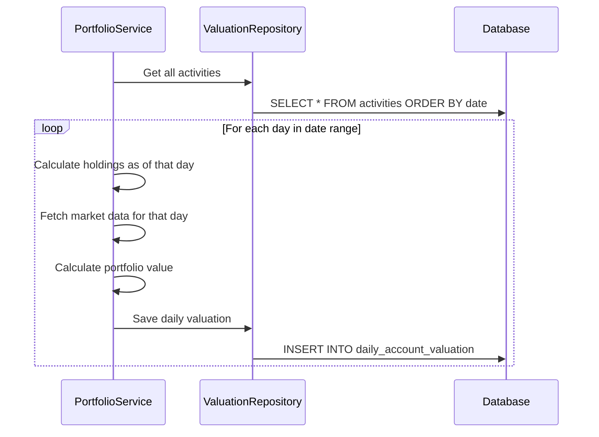

# Portfolio Calculation Workflow

This document details how Wealthfolio calculates portfolio holdings, valuations,
and performance metrics using the FIFO (First-In-First-Out) algorithm.

## Overview

Portfolio calculation is a complex, multi-step process that:

1. **Calculates Holdings Snapshots** - FIFO cost basis calculation
2. **Calculates Total Portfolio Value** - Sum of all account values
3. **Calculates Historical Valuations** - Daily portfolio values
4. **Calculates Performance Metrics** - Returns, CAGR, money-weighted return

## High-Level Flow

```mermaid
flowchart LR
    A[Trigger Update] --> B[Portfolio Update Start Event]
    B --> C{Calculate Holdings?}
    C -->|Yes| D[FIFO Calculation]
    C -->|No| E[Use Existing Snapshots]
    D --> E

    E --> F{Market Data?}
    F -->|Cache Hit| G[Use Cached Prices]
    F -->|Cache Miss| H[Fetch Latest Quotes]

    G --> I[Calculate Current Value]
    H --> I

    I --> J[Calculate Total Portfolio Value]
    J --> K[Currency Conversion]
    K --> L[Save Daily Valuation]

    L --> M{Historical Data?}
    M -->|Yes| N[Calculate Performance]
    M -->|No| N

    N --> O[Portfolio Update Complete Event]
    O --> P[UI Updates]
```



---

## Step 1: FIFO Holdings Calculation

### Algorithm

Wealthfolio uses FIFO (First-In-First-Out) to calculate cost basis for each
asset:

```
For each asset:
  Sort all BUY activities by date (oldest first)
  Sort all SELL activities by date
  For each SELL:
    Consume from oldest BUY until quantity satisfied
    Calculate average cost: (Sum of costs) / (Total quantity)
```

### Implementation

**Rust Service** (`src-core/src/services/portfolio.rs`):

```rust
impl PortfolioService {
    pub async fn calculate_holdings_snapshots(&self) -> Result``()> {
        // 1. Get all accounts
        let accounts = self.account_repo.find_all().await?;

        for account in accounts {
            // 2. Get all activities for this account
            let activities = self.activity_repo
                .search_activities(Some(account.id), None, None, None)
                .await?;

            // 3. Group by asset
            let mut asset_queues: HashMap`i32`, VecDeque`Activity>`> = HashMap::new();

            // 4. Process BUY activities (add to queues)
            for activity in activities {
                if activity.activity_type == ActivityType::BUY {
                    let queue = asset_queues
                        .entry(activity.asset_id)
                        .or_insert_with(VecDeque::new);
                    queue.push_back(activity);
                }
            }

            // 5. Process SELL activities (consume from queues)
            for activity in activities {
                if activity.activity_type == ActivityType::SELL {
                    let queue = asset_queues.get_mut(&activity.asset_id)
                        .ok_or(Error::AssetNotFound)?;

                    let mut remaining_sell_qty = activity.quantity;
                    let mut total_cost = Decimal::ZERO;

                    while remaining_sell_qty > Decimal::ZERO && !queue.is_empty() {
                        let oldest_buy = queue.front_mut()
                            .ok_or(Error::InsufficientHoldings)?;

                        let buy_qty = oldest_buy.quantity;

                        if buy_qty ``= remaining_sell_qty {
                            // Consume entire BUY
                            total_cost += buy_qty * oldest_buy.unit_price;
                            remaining_sell_qty -= buy_qty;
                            queue.pop_front();
                        } else {
                            // Consume partial BUY
                            let consumed_qty = remaining_sell_qty;
                            total_cost += consumed_qty * oldest_buy.unit_price;
                            oldest_buy.quantity -= consumed_qty;
                            remaining_sell_qty = Decimal::ZERO;
                        }
                    }

                    // Calculate average cost
                    let avg_cost = total_cost / activity.quantity;

                    // 6. Save snapshot
                    let snapshot = HoldingSnapshot {
                        account_id: account.id,
                        asset_id: activity.asset_id,
                        quantity: activity.quantity,
                        avg_cost,
                        current_value: Decimal::ZERO, // Will be calculated in step 2
                    };
                    self.snapshot_repo.save(snapshot).await?;
                }
            }

            // 7. Save remaining holdings (unsold positions)
            for (asset_id, queue) in asset_queues {
                if !queue.is_empty() {
                    for activity in queue {
                        let snapshot = HoldingSnapshot {
                            account_id: account.id,
                            asset_id,
                            quantity: activity.quantity,
                            avg_cost: activity.unit_price,
                            current_value: Decimal::ZERO,
                        };
                        self.snapshot_repo.save(snapshot).await?;
                    }
                }
            }
        }

        Ok(())
    }
}
```

### Example

**Activities**:

| Date       | Type | Symbol | Quantity | Price |
| ---------- | ---- | ------ | -------- | ----- |
| 2024-01-01 | BUY  | AAPL   | 100      | $150  |
| 2024-02-01 | BUY  | AAPL   | 50       | $160  |
| 2024-03-01 | SELL | AAPL   | 75       | $170  |

**FIFO Calculation**:

1. **BUY Queue**:
   - [BUY: 100 @ $150, BUY: 50 @ $160]

2. **Process SELL: 75 shares**:
   - Consume 75 from oldest BUY (100 @ $150)
   - Remaining in queue: [BUY: 25 @ $150, BUY: 50 @ $160]

3. **Average Cost**:

   ```
   Total Cost = 75 × $150 = $11,250
   Average Cost = $11,250 / 75 = $150
   ```

4. **Resulting Holdings**:
   - AAPL: 25 @ $150
   - AAPL: 50 @ $160

---

## Step 2: Market Data Synchronization

### Fetching Quotes

```rust
impl PortfolioService {
    async fn sync_market_data(&self, holdings: Vec`HoldingSnapshot>`) -> Result`HashMap``i32`, Quote>> {
        let mut quotes: HashMap`i32`, Quote> = HashMap::new();

        for holding in holdings {
            // Check cache first (TTL: 15 minutes)
            if let Some(cached) = self.cache.get(&holding.asset_id) {
                quotes.insert(holding.asset_id, cached);
                continue;
            }

            // Fetch from appropriate provider
            let asset = self.asset_repo.find_by_id(holding.asset_id).await?;
            let quote = match asset.data_source {
                DataSource::YahooFinance => {
                    self.yahoo_provider.fetch_quote(&asset.symbol).await?
                }
                DataSource::VCI => {
                    self.vci_provider.fetch_quote(&asset.symbol).await?
                }
                DataSource::FMarket => {
                    self.fmarket_provider.fetch_quote(&asset.symbol).await?
                }
                DataSource::Manual => {
                    // Use manually entered price
                    self.quote_repo.get_latest_quote(holding.asset_id).await?
                }
            };

            // Cache for 15 minutes
            self.cache.insert(holding.asset_id, quote.clone());

            quotes.insert(holding.asset_id, quote);
        }

        Ok(quotes)
    }
}
```

### Caching Strategy

| Data Type      | Cache Location | TTL    | Eviction Policy |
| -------------- | -------------- | ------ | --------------- |
| Global quotes  | Moka (backend) | 15 min | Time-based      |
| VN stocks      | Moka + DB      | 15 min | Time-based      |
| Exchange rates | Moka (backend) | 1 hour | Time-based      |

---

## Step 3: Current Value Calculation

### Formula

```
Account Value = Σ(Holding Quantity × Current Price)
Total Portfolio Value = Σ(Account Value) - (Dividends + Interest)
```

### Implementation

```rust
impl PortfolioService {
    async fn calculate_current_value(
        &self,
        holdings: Vec`HoldingSnapshot>`,
        quotes: &HashMap`i32`, Quote>,
    ) -> Result`Decimal>` {
        let mut total_value = Decimal::ZERO;

        for holding in holdings {
            let quote = quotes.get(&holding.asset_id)
                .ok_or(Error::QuoteNotFound)?;

            let value = holding.quantity * quote.price;

            // Update holding current value
            let mut updated_holding = holding.clone();
            updated_holding.current_value = value;
            self.snapshot_repo.update(updated_holding).await?;

            // Convert to base currency if needed
            let base_currency = self.get_base_currency();
            let converted_value = if quote.currency != base_currency {
                let rate = self.fx_service.get_exchange_rate(&quote.currency).await?;
                value * rate
            } else {
                value
            };

            total_value += converted_value;
        }

        Ok(total_value)
    }
}
```

### Currency Conversion

```rust
impl FxService {
    async fn get_exchange_rate(&self, from_currency: &str) -> Result`Decimal>` {
        let to_currency = self.get_base_currency();

        // Check cache
        let cache_key = format!("{}:{}", from_currency, to_currency);
        if let Some(cached) = self.cache.get(&cache_key) {
            return Ok(cached);
        }

        // Fetch from external API
        let rate = match self.provider {
            FxProvider::OpenExchangeRates => {
                self.fetch_rate_open_exchange(from_currency, to_currency).await?
            }
            FxProvider::YahooFinance => {
                self.fetch_rate_yahoo(from_currency, to_currency).await?
            }
        };

        // Cache for 1 hour
        self.cache.insert(cache_key, rate);

        Ok(rate)
    }
}
```

---

## Step 4: Historical Valuation Calculation

### Daily Valuations



### Implementation

```rust
impl PortfolioService {
    pub async fn calculate_valuation_history(
        &self,
        account_id: i32,
        start_date: NaiveDate,
        end_date: NaiveDate,
    ) -> Result`Vec``AccountValuation>`> {
        let mut valuations = Vec::new();
        let mut current_date = start_date;

        while current_date ``= end_date {
            // Get activities up to current date
            let activities = self.activity_repo
                .search_activities(Some(account_id), None, Some(start_date), Some(current_date))
                .await?;

            // Calculate holdings as of current date
            let holdings = self.calculate_holdings_from_activities(&activities).await?;

            // Get market data for current date
            let quotes = self.market_data_service
                .get_historical_quotes(&holdings, current_date)
                .await?;

            // Calculate value
            let total_value = self.calculate_value_from_holdings(&holdings, &quotes).await?;

            valuations.push(AccountValuation {
                account_id,
                date: current_date,
                value: total_value,
                contributions: self.calculate_contributions(&activities).await?,
            });

            current_date = current_date.succ_opt()
                .ok_or(Error::DateOverflow)?;
        }

        Ok(valuations)
    }
}
```

---

## Step 5: Performance Metrics Calculation

### Simple Return

```
Simple Return = (Current Value - Initial Investment) / Initial Investment × 100%

Initial Investment = Sum of all BUY activities (excluding deposits)
```

### CAGR (Compound Annual Growth Rate)

```
CAGR = (Current Value / Initial Investment)^(1 / years) - 1

years = (Current Date - Start Date) / 365.25
```

### Money-Weighted Return (XIRR)

Uses the XIRR (Extended Internal Rate of Return) algorithm, considering:

- All cash flows (BUY, SELL, DEPOSIT, WITHDRAWAL)
- Timing of cash flows
- Current portfolio value

```rust
impl PerformanceService {
    pub async fn calculate_money_weighted_return(
        &self,
        account_id: i32,
        start_date: NaiveDate,
        end_date: NaiveDate,
    ) -> Result`Decimal>` {
        // 1. Get all activities in date range
        let activities = self.activity_repo
            .search_activities(Some(account_id), None, Some(start_date), Some(end_date))
            .await?;

        // 2. Build cash flow list
        let mut cash_flows: Vec`CashFlow>` = Vec::new();

        for activity in activities {
            let amount = match activity.activity_type {
                ActivityType::BUY => -activity.quantity * activity.unit_price,
                ActivityType::SELL => activity.quantity * activity.unit_price,
                ActivityType::DEPOSIT => -activity.quantity,
                ActivityType::WITHDRAWAL => activity.quantity,
                ActivityType::DIVIDEND => activity.quantity,
                ActivityType::INTEREST => activity.quantity,
                ActivityType::FEE => -activity.quantity,
            };

            cash_flows.push(CashFlow {
                date: activity.date,
                amount,
            });
        }

        // 3. Get current portfolio value
        let current_value = self.portfolio_service
            .calculate_current_value(account_id, end_date)
            .await?;

        // 4. Add final cash flow (current value)
        cash_flows.push(CashFlow {
            date: end_date,
            amount: current_value,
        });

        // 5. Calculate XIRR using Newton-Raphson method
        let xirr = self.calculate_xirr(&cash_flows)?;

        Ok(xirr)
    }

    fn calculate_xirr(&self, cash_flows: &[CashFlow]) -> Result`Decimal>` {
        // Newton-Raphson iteration to find rate where NPV = 0
        let mut rate = Decimal::ZERO;

        for _ in 0..100 {
            let (npv, derivative) = self.npv_and_derivative(cash_flows, rate)?;

            if derivative == Decimal::ZERO {
                break;
            }

            let new_rate = rate - npv / derivative;

            if (new_rate - rate).abs() `` Decimal::from_str("0.0001")? {
                return Ok(new_rate);
            }

            rate = new_rate;
        }

        Ok(rate)
    }
}
```

### Period-Based Returns (YTD, 1M, 3M, 1Y, etc.)

```rust
impl PerformanceService {
    pub async fn calculate_period_returns(
        &self,
        account_id: i32,
        base_date: NaiveDate,
    ) -> Result`HashMap``String`, Decimal>> {
        let mut returns = HashMap::new();

        let periods = [
            ("YTD", self.start_of_year(base_date)),
            ("1M", base_date - Duration::days(30)),
            ("3M", base_date - Duration::days(90)),
            ("6M", base_date - Duration::days(180)),
            ("1Y", base_date - Duration::days(365)),
            ("3Y", base_date - Duration::days(1095)),
            ("5Y", base_date - Duration::days(1825)),
        ];

        for (period_name, start_date) in periods {
            let initial_value = self.get_valuation_at_date(account_id, start_date).await?;
            let current_value = self.get_valuation_at_date(account_id, base_date).await?;

            let period_return = if initial_value > Decimal::ZERO {
                (current_value - initial_value) / initial_value * Decimal::from(100)
            } else {
                Decimal::ZERO
            };

            returns.insert(period_name.to_string(), period_return);
        }

        Ok(returns)
    }
}
```

---

## Event-Driven Updates

### Backend Events

```rust
// Emit event before calculation
app.emit_all("portfolio:update-start", ())?;

// ... perform calculations ...

// Emit event after successful calculation
app.emit_all("portfolio:update-complete", ())?;
```

### Frontend Listeners

```typescript
import { listen } from "@tauri-apps/api/event";

useEffect(() => {
  const unlistenStart = listen("portfolio:update-start", () => {
    setIsUpdating(true);
  });

  const unlistenComplete = listen("portfolio:update-complete", () => {
    setIsUpdating(false);
    // Invalidate queries to trigger refetch
    queryClient.invalidateQueries(["holdings"]);
    queryClient.invalidateQueries(["valuations"]);
    queryClient.invalidateQueries(["performance"]);
  });

  return () => {
    unlistenStart.then((f) => f());
    unlistenComplete.then((f) => f());
  };
}, []);
```

---

## Performance Optimization

### Database Indexes

```sql
-- Optimize activity lookups
CREATE INDEX idx_activities_account_date ON activities(account_id, date);

-- Optimize snapshot queries
CREATE INDEX idx_holdings_snapshots_account ON holdings_snapshots(account_id);

-- Optimize valuation history
CREATE INDEX idx_daily_valuation_account_date ON daily_account_valuation(account_id, date);
```

### Batch Operations

```rust
// Bulk insert for performance
let valuations: Vec`NewAccountValuation>` = /* ... */;

diesel::insert_into(daily_account_valuation::table)
    .values(&valuations)
    .execute(&mut conn)
    .map_err(Error::Database)?;
```

### Caching

- **Holdings snapshots**: Calculated once per portfolio update
- **Market quotes**: Cached for 15 minutes
- **Exchange rates**: Cached for 1 hour
- **Historical valuations**: Persisted in database

---

## Error Handling

```rust
#[derive(Debug, thiserror::Error)]
pub enum PortfolioError {
    #[error("Insufficient holdings for sell: {0}")]
    InsufficientHoldings(String),

    #[error("Asset not found: {0}")]
    AssetNotFound(i32),

    #[error("Quote not found for asset: {0}")]
    QuoteNotFound(i32),

    #[error("Invalid date range: {0}")]
    InvalidDateRange(String),

    #[error("Calculation error: {0}")]
    CalculationError(String),
}
```

---

## Triggers

### Manual Trigger

User clicks "Update Portfolio" button:

```typescript
await invoke("update_portfolio");
```

### Automatic Triggers

1. **After Activity Import**:

   ```rust
   self.portfolio_service.update_portfolio().await?;
   ```

2. **After Market Data Sync**:

   ```rust
   // Automatically update valuations with new prices
   self.portfolio_service.calculate_current_value().await?;
   ```

3. **Scheduled Updates**:
   ```rust
   // Background task every 15 minutes
   tokio::spawn(async move {
       loop {
           tokio::time::sleep(Duration::from_secs(900)).await;
           portfolio_service.update_portfolio().await.ok();
       }
   });
   ```

---

## Next Steps

- [Data Flow](../architecture/data-flow) - Complete system data flow
- [Activity Import Workflow](./activity-import) - CSV import process
- [Market Data Sync Workflow](./market-data-sync) - Market data update flow
- [Performance Analytics](../features/performance-analytics) - Performance
  calculation details
